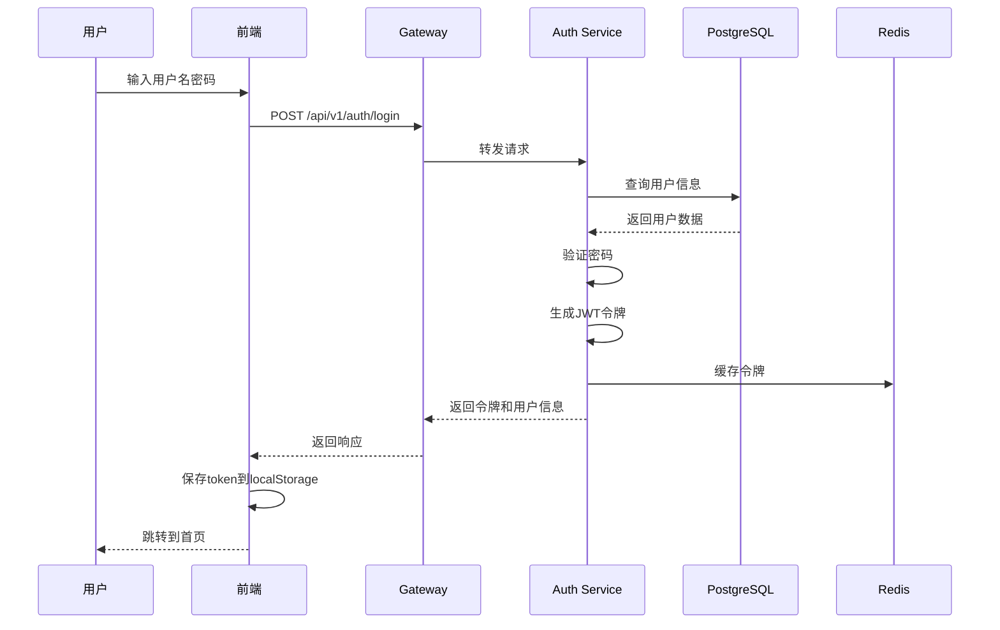
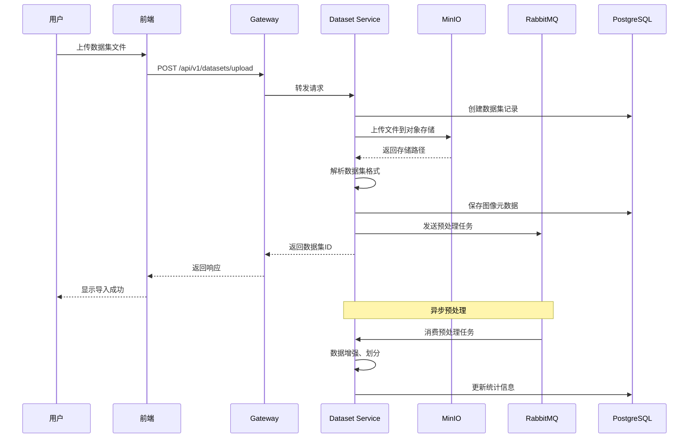
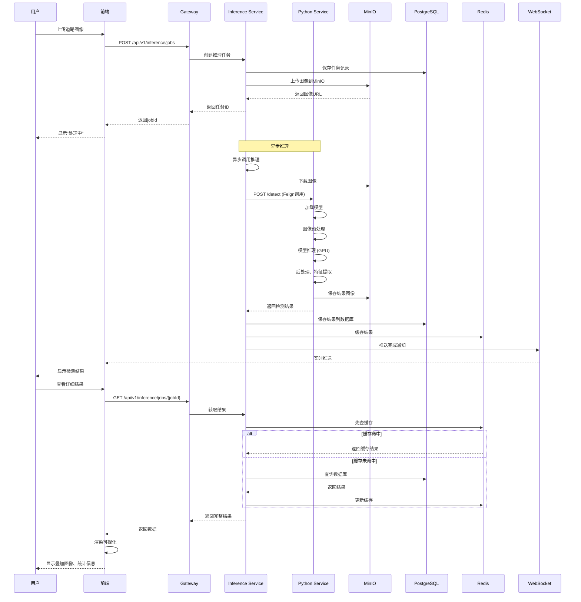
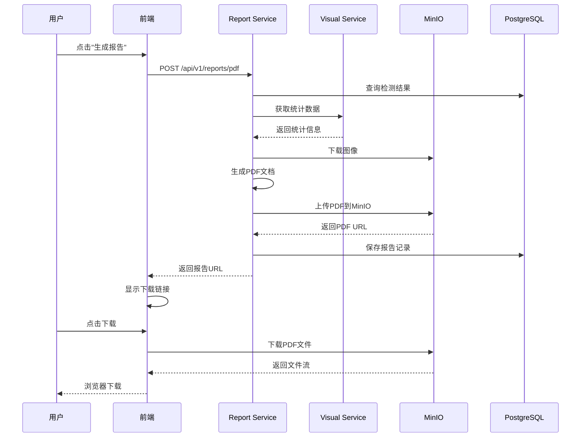
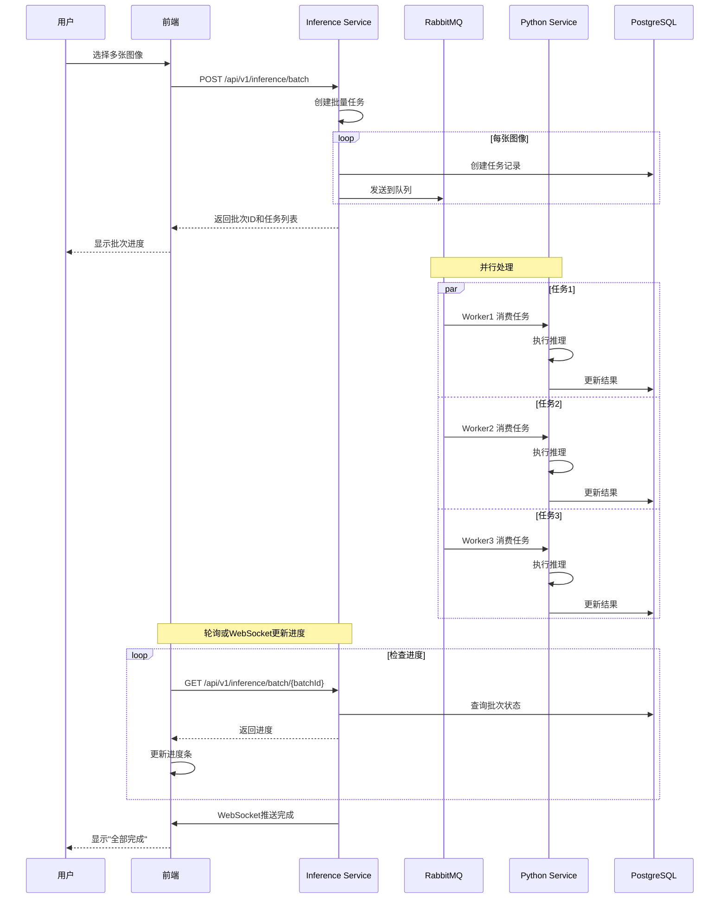

# 云端协同道路状态检测系统设计方案

## 📋 文档信息

- **项目名称**: 云端协同道路状态检测系统
- **技术架构**: Java + Python 混合微服务架构
- **文档版本**: v2.0
- **更新日期**: 2025-11-06
- **负责人**: 高绅语
- **指导教师**: 杨飞

---

## 目录

1. [系统概述](#1-系统概述)
2. [系统架构设计](#2-系统架构设计)
3. [技术栈选型](#3-技术栈选型)
4. [核心模块设计](#4-核心模块设计)
5. [数据库设计](#5-数据库设计)
6. [接口设计](#6-接口设计)
7. [系统交互流程](#7-系统交互流程)
8. [部署方案](#8-部署方案)
9. [性能优化](#9-性能优化)
10. [安全方案](#10-安全方案)
11. [监控与运维](#11-监控与运维)
12. [开发计划](#12-开发计划)

---

## 1. 系统概述

### 1.1 项目背景

道路裂纹是道路损坏的早期表现，及时检测和修复对于保障交通安全、延长道路使用寿命具有重要意义。传统的人工巡检方式效率低、成本高、主观性强。本系统利用深度学习技术实现道路裂纹的自动化检测，结合云端协同架构，为道路养护提供智能化、精准化的决策支持。

### 1.2 核心目标

| 指标类型 | 具体指标 | 目标值 |
|---------|---------|--------|
| **检测精度** | 平均IoU | ≥ 85% |
| **检测精度** | 小目标召回率 | ≥ 80% |
| **检测精度** | 精确率 | ≥ 88% |
| **性能指标** | 单张图像处理时间 | ≤ 5秒 |
| **性能指标** | 批量处理能力 | ≥ 10张/秒 |
| **系统指标** | 并发用户数 | ≥ 100 |
| **系统指标** | 系统可用性 | ≥ 99.5% |

### 1.3 系统特点

🎯 **混合架构**: Java处理业务逻辑，Python处理AI推理，各取所长  
☁️ **云端协同**: 分布式部署，弹性扩展，负载均衡  
🔒 **安全可靠**: JWT认证，数据加密，权限控制  
📊 **可视化**: 交互式界面，多图层展示，自动报告生成  
🚀 **高性能**: 异步处理，缓存优化，批量推理  
📦 **易部署**: Docker容器化，Kubernetes编排  

---

## 2. 系统架构设计

### 2.1 总体架构图

```
┌─────────────────────────────────────────────────────────────────────────┐
│                          用户层 (User Layer)                              │
│  ┌──────────────┐  ┌──────────────┐  ┌──────────────┐                   │
│  │   Web浏览器   │  │  移动端APP   │  │   管理后台    │                   │
│  │   (Vue 3)    │  │  (Flutter)   │  │   (Vue 3)    │                   │
│  └──────────────┘  └──────────────┘  └──────────────┘                   │
└─────────────────────────────────────────────────────────────────────────┘
                                  ↓ HTTPS
┌─────────────────────────────────────────────────────────────────────────┐
│                      接入层 (Gateway Layer)                               │
│  ┌─────────────────────────────────────────────────────────────────┐   │
│  │          Spring Cloud Gateway (Nginx备选)                        │   │
│  │  • 路由转发  • 负载均衡  • 限流熔断  • 认证鉴权  • 日志追踪      │   │
│  └─────────────────────────────────────────────────────────────────┘   │
└─────────────────────────────────────────────────────────────────────────┘
                                  ↓
┌─────────────────────────────────────────────────────────────────────────┐
│                     业务服务层 (Business Service Layer)                   │
│  ┌────────────────┐  ┌────────────────┐  ┌────────────────┐            │
│  │  认证服务       │  │  数据集服务     │  │  推理服务       │            │
│  │  cloud-auth    │  │  cloud-dataset │  │  cloud-inference│            │
│  │  Spring Boot   │  │  Spring Boot   │  │  Spring Boot   │            │
│  │  • 用户管理     │  │  • 数据导入     │  │  • 任务管理     │            │
│  │  • JWT认证     │  │  • 格式转换     │  │  • 结果处理     │            │
│  │  • 权限控制     │  │  • 数据增强     │  │  • 批量推理     │            │
│  └────────────────┘  └────────────────┘  └────────────────┘            │
│                                                                           │
│  ┌────────────────┐  ┌────────────────┐  ┌────────────────┐            │
│  │  可视化服务     │  │  报告服务       │  │  任务调度服务   │            │
│  │  cloud-visual  │  │  cloud-report  │  │  cloud-task    │            │
│  │  Spring Boot   │  │  Spring Boot   │  │  XXL-Job       │            │
│  │  • 图像叠加     │  │  • PDF生成     │  │  • 定时任务     │            │
│  │  • 热力图       │  │  • Excel导出   │  │  • 异步处理     │            │
│  │  • 统计分析     │  │  • 报告模板     │  │  • 消息消费     │            │
│  └────────────────┘  └────────────────┘  └────────────────┘            │
└─────────────────────────────────────────────────────────────────────────┘
                                  ↓ HTTP/gRPC
┌─────────────────────────────────────────────────────────────────────────┐
│                      AI推理层 (AI Inference Layer)                        │
│  ┌─────────────────────────────────────────────────────────────────┐   │
│  │               Python推理服务 (FastAPI + PyTorch)                  │   │
│  │  • 模型加载  • 图像预处理  • 模型推理  • 后处理  • 特征提取       │   │
│  └─────────────────────────────────────────────────────────────────┘   │
│  ┌──────────────┐  ┌──────────────┐  ┌──────────────┐                 │
│  │  U-Net模型   │  │  DeepLabV3+  │  │  自定义模型   │                 │
│  │  (基础版本)  │  │  (高精度版)  │  │  (边缘检测)   │                 │
│  └──────────────┘  └──────────────┘  └──────────────┘                 │
│                         GPU计算节点池                                    │
└─────────────────────────────────────────────────────────────────────────┘
                                  ↓
┌─────────────────────────────────────────────────────────────────────────┐
│                    数据存储层 (Data Storage Layer)                        │
│  ┌────────────┐  ┌────────────┐  ┌────────────┐  ┌────────────┐       │
│  │ PostgreSQL │  │   Redis    │  │   MinIO    │  │  RabbitMQ  │       │
│  │ (主数据库) │  │  (缓存)    │  │ (对象存储) │  │ (消息队列) │       │
│  │ • 业务数据  │  │ • 会话     │  │ • 图像     │  │ • 异步任务  │       │
│  │ • 元数据    │  │ • 热数据   │  │ • 模型     │  │ • 事件总线  │       │
│  │ • 用户信息  │  │ • 分布式锁 │  │ • 结果     │  │ • 日志队列  │       │
│  └────────────┘  └────────────┘  └────────────┘  └────────────┘       │
│                                                                           │
│  ┌────────────┐  ┌────────────┐                                         │
│  │Elasticsearch│  │  MongoDB   │                                         │
│  │ (日志搜索) │  │(文档存储)  │                                         │
│  └────────────┘  └────────────┘                                         │
└─────────────────────────────────────────────────────────────────────────┘
                                  ↓
┌─────────────────────────────────────────────────────────────────────────┐
│                   监控运维层 (Monitoring & Ops Layer)                     │
│  ┌────────────┐  ┌────────────┐  ┌────────────┐  ┌────────────┐       │
│  │ Prometheus │  │  Grafana   │  │    ELK     │  │   Jaeger   │       │
│  │ (指标采集) │  │ (可视化)   │  │ (日志分析) │  │ (链路追踪) │       │
│  └────────────┘  └────────────┘  └────────────┘  └────────────┘       │
└─────────────────────────────────────────────────────────────────────────┘
```

### 2.2 微服务拆分策略

#### 2.2.1 服务划分原则

- **业务边界清晰**: 按照业务领域进行拆分
- **高内聚低耦合**: 服务内部功能内聚，服务间松耦合
- **独立部署**: 每个服务可以独立开发、测试、部署
- **技术异构**: Java和Python各司其职

#### 2.2.2 服务清单

| 服务名称 | 技术栈 | 端口 | 职责 | 依赖服务 |
|---------|--------|------|------|---------|
| **cloud-gateway** | Spring Cloud Gateway | 8080 | API网关、路由转发、认证 | Redis |
| **cloud-auth** | Spring Boot + Security | 8081 | 用户认证、权限管理 | PostgreSQL, Redis |
| **cloud-dataset** | Spring Boot + MyBatis Plus | 8082 | 数据集管理、预处理 | PostgreSQL, MinIO, RabbitMQ |
| **cloud-inference** | Spring Boot + Feign | 8083 | 推理任务管理、结果处理 | PostgreSQL, Redis, Python推理服务 |
| **cloud-visual** | Spring Boot | 8084 | 图像可视化、叠加生成 | PostgreSQL, MinIO |
| **cloud-report** | Spring Boot + iText | 8085 | 报告生成、数据导出 | PostgreSQL, MinIO |
| **cloud-task** | XXL-Job | 8086 | 定时任务、异步任务 | RabbitMQ, Redis |
| **python-inference** | FastAPI + PyTorch | 8090 | 模型推理、图像处理 | MinIO, Redis |

### 2.3 服务间通信方式

#### 2.3.1 同步通信

```java
// 使用OpenFeign进行服务间调用
@FeignClient(name = "python-inference", url = "${python.inference.url}")
public interface PythonInferenceClient {
    @PostMapping("/api/v1/inference/detect")
    DetectionResult detect(@RequestBody DetectionRequest request);
}
```

**适用场景**:
- Java服务调用Python推理服务
- 需要立即获取结果的场景
- 实时性要求高的业务

#### 2.3.2 异步通信

```java
// 使用RabbitMQ进行异步通信
@Component
public class InferenceTaskProducer {
    @Autowired
    private RabbitTemplate rabbitTemplate;
    
    public void sendInferenceTask(InferenceTask task) {
        rabbitTemplate.convertAndSend(
            "inference.exchange", 
            "inference.task", 
            task
        );
    }
}
```

**适用场景**:
- 批量处理任务
- 不需要立即返回结果
- 削峰填谷场景

### 2.4 数据流转架构

```
用户上传图像
     ↓
API Gateway (验证、限流)
     ↓
cloud-dataset (保存到MinIO，元数据入库)
     ↓
cloud-inference (创建推理任务)
     ↓
RabbitMQ (任务队列)
     ↓
python-inference (模型推理)
     ↓
cloud-inference (结果处理、入库)
     ↓
cloud-visual (生成可视化结果)
     ↓
MinIO (保存结果图像)
     ↓
用户查看结果
```

---

## 3. 技术栈选型

### 3.1 后端技术栈（Java）

#### 3.1.1 核心框架

| 技术 | 版本 | 用途 | 选型理由 |
|------|------|------|----------|
| **JDK** | 17 LTS | Java运行环境 | 长期支持版本，性能优化 |
| **Spring Boot** | 3.2.0 | 微服务框架 | 简化配置，快速开发，生态完善 |
| **Spring Cloud** | 2023.0.0 | 微服务治理 | 服务注册、配置管理、熔断降级 |
| **Spring Cloud Gateway** | 4.1.0 | API网关 | 响应式架构，性能优异 |
| **Spring Security** | 6.2.0 | 安全框架 | 认证授权、防护机制完善 |
| **MyBatis Plus** | 3.5.5 | ORM框架 | 简化CRUD，代码生成器 |

#### 3.1.2 服务治理

| 技术 | 版本 | 用途 | 选型理由 |
|------|------|------|----------|
| **Nacos** | 2.3.0 | 服务注册与配置 | 阿里开源，功能全面，社区活跃 |
| **Sentinel** | 1.8.6 | 流量控制与熔断 | 轻量级，规则动态配置 |
| **Seata** | 1.7.0 | 分布式事务 | 多种事务模式，性能好 |
| **OpenFeign** | 4.1.0 | 声明式HTTP客户端 | 简化服务调用，集成负载均衡 |

#### 3.1.3 数据访问

| 技术 | 版本 | 用途 | 选型理由 |
|------|------|------|----------|
| **PostgreSQL** | 15.5 | 关系数据库 | 功能强大，支持JSON，GIS扩展 |
| **Redis** | 7.2 | 缓存 | 高性能，丰富的数据结构 |
| **Redisson** | 3.25.2 | Redis客户端 | 分布式锁，对象映射 |
| **Druid** | 1.2.20 | 数据库连接池 | 监控功能强大，SQL防注入 |
| **MinIO** | 8.5.7 | 对象存储 | S3兼容，私有化部署 |

#### 3.1.4 消息队列

| 技术 | 版本 | 用途 | 选型理由 |
|------|------|------|----------|
| **RabbitMQ** | 3.12.10 | 消息队列 | 可靠性高，管理界面友好 |
| **Spring AMQP** | 3.1.0 | AMQP协议 | Spring官方支持 |

#### 3.1.5 任务调度

| 技术 | 版本 | 用途 | 选型理由 |
|------|------|------|----------|
| **XXL-Job** | 2.4.0 | 分布式任务调度 | 轻量级，易于使用 |
| **Spring Task** | 6.1.0 | 简单定时任务 | Spring内置 |

### 3.2 AI推理技术栈（Python）

| 技术 | 版本 | 用途 | 选型理由 |
|------|------|------|----------|
| **Python** | 3.10+ | 编程语言 | AI生态最完善 |
| **FastAPI** | 0.108.0 | Web框架 | 高性能，自动生成文档 |
| **PyTorch** | 2.1.0 | 深度学习框架 | 灵活，社区活跃 |
| **TorchServe** | 0.9.0 | 模型服务化 | 官方推理服务器 |
| **OpenCV** | 4.8.0 | 图像处理 | 功能全面，性能优异 |
| **Pillow** | 10.1.0 | 图像处理 | 简单易用 |
| **Albumentations** | 1.3.1 | 数据增强 | 增强方法丰富 |
| **scikit-image** | 0.22.0 | 图像处理 | 科学计算 |

### 3.3 前端技术栈

| 技术 | 版本 | 用途 | 选型理由 |
|------|------|------|----------|
| **Vue** | 3.3.0 | 前端框架 | 响应式，组件化 |
| **TypeScript** | 5.3.0 | 类型系统 | 类型安全，提高代码质量 |
| **Vite** | 5.0.0 | 构建工具 | 快速热更新 |
| **Element Plus** | 2.4.0 | UI组件库 | 组件丰富，文档完善 |
| **ECharts** | 5.4.0 | 数据可视化 | 图表类型丰富 |
| **Fabric.js** | 5.3.0 | Canvas操作 | 图像标注 |
| **Pinia** | 2.1.0 | 状态管理 | Vue3官方推荐 |
| **Axios** | 1.6.0 | HTTP客户端 | Promise API |

### 3.4 DevOps技术栈

| 技术 | 版本 | 用途 | 选型理由 |
|------|------|------|----------|
| **Docker** | 24.0+ | 容器化 | 标准容器技术 |
| **Kubernetes** | 1.28+ | 容器编排 | 生产级编排工具 |
| **Jenkins** | 2.426+ | CI/CD | 插件丰富，灵活 |
| **GitLab CI** | 16.6+ | CI/CD | 与Git集成好 |
| **Harbor** | 2.9+ | 镜像仓库 | 私有仓库，安全 |

### 3.5 监控技术栈

| 技术 | 版本 | 用途 | 选型理由 |
|------|------|------|----------|
| **Prometheus** | 2.48+ | 指标采集 | 时序数据库，强大的查询 |
| **Grafana** | 10.2+ | 可视化 | 丰富的图表和面板 |
| **Elasticsearch** | 8.11+ | 日志存储与搜索 | 全文搜索强大 |
| **Logstash** | 8.11+ | 日志收集 | 数据管道 |
| **Kibana** | 8.11+ | 日志可视化 | ELK套件 |
| **Jaeger** | 1.51+ | 链路追踪 | 分布式追踪 |
| **SkyWalking** | 9.6+ | APM监控 | 国产，对Java友好 |

---

## 4. 核心模块设计

### 4.1 认证服务 (cloud-auth)

#### 4.1.1 功能设计

**核心功能**:
- 用户注册、登录、登出
- JWT令牌生成与验证
- 权限管理（RBAC）
- 第三方登录（GitHub、Google）
- 密码加密与重置

**技术实现**:
```java
@Service
@RequiredArgsConstructor
public class AuthService {
    
    private final UserMapper userMapper;
    private final RedisTemplate<String, String> redisTemplate;
    private final PasswordEncoder passwordEncoder;
    private final JwtTokenProvider jwtTokenProvider;
    
    /**
     * 用户登录
     */
    public LoginResponse login(LoginRequest request) {
        // 1. 验证用户名密码
        User user = userMapper.selectOne(
            new LambdaQueryWrapper<User>()
                .eq(User::getUsername, request.getUsername())
        );
        
        if (user == null || !passwordEncoder.matches(
                request.getPassword(), user.getPassword())) {
            throw new BadCredentialsException("用户名或密码错误");
        }
        
        // 2. 生成JWT令牌
        String accessToken = jwtTokenProvider.generateAccessToken(user);
        String refreshToken = jwtTokenProvider.generateRefreshToken(user);
        
        // 3. 缓存到Redis
        String key = "user:token:" + user.getId();
        redisTemplate.opsForValue().set(key, accessToken, 7, TimeUnit.DAYS);
        
        // 4. 记录登录日志
        saveLoginLog(user.getId(), request.getIpAddress());
        
        return LoginResponse.builder()
            .accessToken(accessToken)
            .refreshToken(refreshToken)
            .expiresIn(3600)
            .tokenType("Bearer")
            .userInfo(convertToUserInfo(user))
            .build();
    }
    
    /**
     * 刷新令牌
     */
    public LoginResponse refreshToken(String refreshToken) {
        if (!jwtTokenProvider.validateToken(refreshToken)) {
            throw new TokenExpiredException("刷新令牌已过期");
        }
        
        Long userId = jwtTokenProvider.getUserIdFromToken(refreshToken);
        User user = userMapper.selectById(userId);
        
        String newAccessToken = jwtTokenProvider.generateAccessToken(user);
        
        return LoginResponse.builder()
            .accessToken(newAccessToken)
            .expiresIn(3600)
            .tokenType("Bearer")
            .build();
    }
    
    /**
     * 登出
     */
    public void logout(Long userId) {
        String key = "user:token:" + userId;
        redisTemplate.delete(key);
    }
}
```

#### 4.1.2 权限模型（RBAC）

```java
/**
 * 用户-角色-权限模型
 */

// 用户表
@Data
@TableName("sys_user")
public class User {
    private Long id;
    private String username;
    private String password;
    private String email;
    private String phone;
    private Integer status; // 0-禁用 1-启用
    private LocalDateTime createdAt;
}

// 角色表
@Data
@TableName("sys_role")
public class Role {
    private Long id;
    private String roleName;
    private String roleCode;
    private String description;
    private Integer status;
}

// 权限表
@Data
@TableName("sys_permission")
public class Permission {
    private Long id;
    private String permissionName;
    private String permissionCode;
    private String resourceType; // menu, button, api
    private String resourcePath;
    private String method; // GET, POST, PUT, DELETE
}

// 用户-角色关联表
@Data
@TableName("sys_user_role")
public class UserRole {
    private Long userId;
    private Long roleId;
}

// 角色-权限关联表
@Data
@TableName("sys_role_permission")
public class RolePermission {
    private Long roleId;
    private Long permissionId;
}
```

#### 4.1.3 JWT工具类

```java
@Component
@ConfigurationProperties(prefix = "jwt")
@Data
public class JwtTokenProvider {
    
    private String secretKey;
    private long accessTokenValidityInSeconds = 3600; // 1小时
    private long refreshTokenValidityInSeconds = 604800; // 7天
    
    /**
     * 生成访问令牌
     */
    public String generateAccessToken(User user) {
        Map<String, Object> claims = new HashMap<>();
        claims.put("userId", user.getId());
        claims.put("username", user.getUsername());
        claims.put("roles", getUserRoles(user.getId()));
        
        return Jwts.builder()
            .setClaims(claims)
            .setSubject(user.getUsername())
            .setIssuedAt(new Date())
            .setExpiration(new Date(System.currentTimeMillis() + 
                accessTokenValidityInSeconds * 1000))
            .signWith(SignatureAlgorithm.HS512, secretKey)
            .compact();
    }
    
    /**
     * 验证令牌
     */
    public boolean validateToken(String token) {
        try {
            Jwts.parser().setSigningKey(secretKey).parseClaimsJws(token);
            return true;
        } catch (JwtException | IllegalArgumentException e) {
            return false;
        }
    }
    
    /**
     * 从令牌中获取用户ID
     */
    public Long getUserIdFromToken(String token) {
        Claims claims = Jwts.parser()
            .setSigningKey(secretKey)
            .parseClaimsJws(token)
            .getBody();
        return Long.valueOf(claims.get("userId").toString());
    }
}
```

### 4.2 数据集管理服务 (cloud-dataset)

#### 4.2.1 数据集导入流程

```java
@Service
@RequiredArgsConstructor
@Slf4j
public class DatasetImportService {
    
    private final MinioService minioService;
    private final DatasetMapper datasetMapper;
    private final ImageMapper imageMapper;
    private final RabbitTemplate rabbitTemplate;
    
    /**
     * 导入数据集
     */
    @Transactional(rollbackFor = Exception.class)
    public DatasetImportResult importDataset(DatasetImportRequest request) {
        log.info("开始导入数据集: {}", request.getName());
        
        // 1. 创建数据集记录
        Dataset dataset = createDatasetRecord(request);
        
        // 2. 根据来源下载数据
        String localPath = downloadDataset(request);
        
        // 3. 解析数据集
        List<ImageInfo> images = parseDataset(localPath, request.getFormat());
        
        // 4. 上传到MinIO
        String storagePath = uploadToMinio(dataset.getId(), localPath);
        dataset.setStoragePath(storagePath);
        
        // 5. 保存图像元数据
        saveImageMetadata(dataset.getId(), images);
        
        // 6. 发送预处理任务到队列
        if (request.isAutoPreprocess()) {
            sendPreprocessTask(dataset.getId(), request.getPreprocessConfig());
        }
        
        // 7. 更新数据集统计信息
        updateDatasetStatistics(dataset);
        
        log.info("数据集导入完成: {}", dataset.getId());
        
        return DatasetImportResult.builder()
            .datasetId(dataset.getId())
            .totalImages(images.size())
            .status("success")
            .build();
    }
    
    /**
     * 解析数据集（支持多种格式）
     */
    private List<ImageInfo> parseDataset(String path, DatasetFormat format) {
        switch (format) {
            case COCO:
                return new CocoFormatParser().parse(path);
            case PASCAL_VOC:
                return new VocFormatParser().parse(path);
            case YOLO:
                return new YoloFormatParser().parse(path);
            case CUSTOM:
                return new CustomFormatParser().parse(path);
            default:
                throw new UnsupportedOperationException("不支持的格式: " + format);
        }
    }
    
    /**
     * 上传到MinIO
     */
    private String uploadToMinio(Long datasetId, String localPath) {
        String bucketName = "crack-detection-datasets";
        String objectPrefix = "dataset-" + datasetId + "/";
        
        File directory = new File(localPath);
        File[] files = directory.listFiles();
        
        for (File file : files) {
            if (file.isFile()) {
                String objectName = objectPrefix + file.getName();
                minioService.uploadFile(file, bucketName, objectName);
            }
        }
        
        return bucketName + "/" + objectPrefix;
    }
    
    /**
     * 发送预处理任务
     */
    private void sendPreprocessTask(Long datasetId, PreprocessConfig config) {
        PreprocessTask task = PreprocessTask.builder()
            .datasetId(datasetId)
            .config(config)
            .taskId(UUID.randomUUID().toString())
            .build();
        
        rabbitTemplate.convertAndSend(
            "preprocessing.exchange",
            "preprocessing.dataset",
            task
        );
    }
}
```

#### 4.2.2 数据预处理

```java
@Service
@RequiredArgsConstructor
public class DataPreprocessService {
    
    /**
     * 数据集划分
     */
    public SplitResult splitDataset(Long datasetId, double[] ratio) {
        // ratio: [train, val, test] = [0.7, 0.15, 0.15]
        
        List<Image> images = imageMapper.selectList(
            new LambdaQueryWrapper<Image>()
                .eq(Image::getDatasetId, datasetId)
        );
        
        // 打乱顺序
        Collections.shuffle(images);
        
        int total = images.size();
        int trainSize = (int) (total * ratio[0]);
        int valSize = (int) (total * ratio[1]);
        
        // 分配split标签
        for (int i = 0; i < total; i++) {
            Image image = images.get(i);
            if (i < trainSize) {
                image.setSplit("train");
            } else if (i < trainSize + valSize) {
                image.setSplit("val");
            } else {
                image.setSplit("test");
            }
            imageMapper.updateById(image);
        }
        
        return SplitResult.builder()
            .trainCount(trainSize)
            .valCount(valSize)
            .testCount(total - trainSize - valSize)
            .build();
    }
    
    /**
     * 数据增强
     */
    public void augmentDataset(Long datasetId, AugmentationConfig config) {
        List<Image> trainImages = imageMapper.selectList(
            new LambdaQueryWrapper<Image>()
                .eq(Image::getDatasetId, datasetId)
                .eq(Image::getSplit, "train")
        );
        
        for (Image image : trainImages) {
            // 应用增强策略
            if (config.isHorizontalFlip() && Math.random() < 0.5) {
                applyHorizontalFlip(image);
            }
            if (config.isVerticalFlip() && Math.random() < 0.5) {
                applyVerticalFlip(image);
            }
            if (config.isRotation()) {
                applyRotation(image, config.getRotationAngle());
            }
            // ... 其他增强操作
        }
    }
}
```

### 4.3 推理服务 (cloud-inference)

#### 4.3.1 推理任务管理

```java
@Service
@RequiredArgsConstructor
@Slf4j
public class InferenceService {
    
    private final PythonInferenceClient pythonClient;
    private final DetectionJobMapper jobMapper;
    private final DetectionResultMapper resultMapper;
    private final MinioService minioService;
    private final RedisTemplate<String, Object> redisTemplate;
    
    /**
     * 创建推理任务
     */
    @Transactional(rollbackFor = Exception.class)
    public InferenceJobResponse createInferenceJob(
            InferenceJobRequest request, Long userId) {
        
        log.info("创建推理任务，用户ID: {}", userId);
        
        // 1. 创建任务记录
        DetectionJob job = DetectionJob.builder()
            .userId(userId)
            .imageUrl(request.getImageUrl())
            .modelVersion(request.getModelVersion())
            .status(JobStatus.PENDING)
            .config(JSON.toJSONString(request.getConfig()))
            .build();
        jobMapper.insert(job);
        
        // 2. 异步调用Python推理服务
        CompletableFuture.runAsync(() -> {
            try {
                executeInference(job);
            } catch (Exception e) {
                log.error("推理失败", e);
                updateJobStatus(job.getId(), JobStatus.FAILED, e.getMessage());
            }
        });
        
        return InferenceJobResponse.builder()
            .jobId(job.getId())
            .status(job.getStatus())
            .createdAt(job.getCreatedAt())
            .build();
    }
    
    /**
     * 执行推理
     */
    private void executeInference(DetectionJob job) {
        log.info("开始执行推理，任务ID: {}", job.getId());
        
        // 1. 更新状态为运行中
        updateJobStatus(job.getId(), JobStatus.RUNNING, null);
        
        // 2. 下载图像
        InputStream imageStream = minioService.getObject(job.getImageUrl());
        MultipartFile file = convertToMultipartFile(imageStream, "image.jpg");
        
        // 3. 调用Python服务
        InferenceConfig config = JSON.parseObject(
            job.getConfig(), InferenceConfig.class);
        
        PythonInferenceRequest pythonRequest = PythonInferenceRequest.builder()
            .threshold(config.getThreshold())
            .minArea(config.getMinArea())
            .returnMask(true)
            .returnVectors(true)
            .returnAttributes(true)
            .build();
        
        PythonInferenceResponse pythonResponse = 
            pythonClient.detect(file, pythonRequest);
        
        // 4. 保存结果
        DetectionResult result = DetectionResult.builder()
            .jobId(job.getId())
            .maskUrl(pythonResponse.getMaskUrl())
            .overlayUrl(pythonResponse.getOverlayUrl())
            .vectors(JSON.toJSONString(pythonResponse.getVectors()))
            .attributes(JSON.toJSONString(pythonResponse.getAttributes()))
            .confidence(pythonResponse.getConfidence())
            .processingTime(pythonResponse.getProcessingTime())
            .build();
        resultMapper.insert(result);
        
        // 5. 更新任务状态
        updateJobStatus(job.getId(), JobStatus.COMPLETED, null);
        job.setResultId(result.getId());
        jobMapper.updateById(job);
        
        // 6. 缓存结果到Redis
        cacheResult(job.getId(), result);
        
        log.info("推理完成，任务ID: {}", job.getId());
    }
    
    /**
     * 批量推理
     */
    public BatchInferenceResponse batchInference(
            BatchInferenceRequest request, Long userId) {
        
        List<Long> jobIds = new ArrayList<>();
        
        for (String imageUrl : request.getImageUrls()) {
            InferenceJobRequest jobRequest = InferenceJobRequest.builder()
                .imageUrl(imageUrl)
                .modelVersion(request.getModelVersion())
                .config(request.getConfig())
                .build();
            
            InferenceJobResponse response = createInferenceJob(jobRequest, userId);
            jobIds.add(response.getJobId());
        }
        
        return BatchInferenceResponse.builder()
            .batchId(UUID.randomUUID().toString())
            .totalJobs(jobIds.size())
            .jobIds(jobIds)
            .status("submitted")
            .build();
    }
    
    /**
     * 获取推理结果
     */
    public DetectionResultResponse getInferenceResult(Long jobId) {
        // 1. 先从缓存获取
        String cacheKey = "inference:result:" + jobId;
        DetectionResult cachedResult = (DetectionResult) 
            redisTemplate.opsForValue().get(cacheKey);
        
        if (cachedResult != null) {
            return convertToResponse(cachedResult);
        }
        
        // 2. 从数据库获取
        DetectionJob job = jobMapper.selectById(jobId);
        if (job == null) {
            throw new ResourceNotFoundException("任务不存在");
        }
        
        if (job.getStatus() != JobStatus.COMPLETED) {
            return DetectionResultResponse.builder()
                .jobId(jobId)
                .status(job.getStatus())
                .build();
        }
        
        DetectionResult result = resultMapper.selectById(job.getResultId());
        return convertToResponse(result);
    }
    
    /**
     * 获取任务列表
     */
    public Page<DetectionJobVO> listJobs(Long userId, JobListQuery query) {
        Page<DetectionJob> page = new Page<>(query.getPage(), query.getSize());
        
        LambdaQueryWrapper<DetectionJob> wrapper = new LambdaQueryWrapper<>();
        wrapper.eq(DetectionJob::getUserId, userId);
        
        if (query.getStatus() != null) {
            wrapper.eq(DetectionJob::getStatus, query.getStatus());
        }
        
        if (StringUtils.hasText(query.getModelVersion())) {
            wrapper.eq(DetectionJob::getModelVersion, query.getModelVersion());
        }
        
        wrapper.orderByDesc(DetectionJob::getCreatedAt);
        
        Page<DetectionJob> resultPage = jobMapper.selectPage(page, wrapper);
        
        return resultPage.convert(this::convertToVO);
    }
}
```

#### 4.3.2 Python推理服务客户端

```java
/**
 * Python推理服务Feign客户端
 */
@FeignClient(
    name = "python-inference",
    url = "${python.inference.url}",
    configuration = PythonInferenceFeignConfig.class
)
public interface PythonInferenceClient {
    
    @PostMapping(
        value = "/api/v1/inference/detect",
        consumes = MediaType.MULTIPART_FORM_DATA_VALUE
    )
    PythonInferenceResponse detect(
        @RequestPart("file") MultipartFile file,
        @SpringQueryMap PythonInferenceRequest request
    );
    
    @GetMapping("/api/v1/inference/result/{jobId}")
    PythonInferenceResponse getResult(@PathVariable("jobId") String jobId);
    
    @PostMapping("/api/v1/inference/batch")
    BatchInferenceResult batchDetect(
        @RequestBody BatchInferenceInput input
    );
    
    @GetMapping("/health")
    HealthCheckResponse healthCheck();
}

/**
 * Feign配置
 */
@Configuration
public class PythonInferenceFeignConfig {
    
    @Bean
    public RequestInterceptor requestInterceptor() {
        return template -> {
            template.header("X-Service-Name", "cloud-inference");
            template.header("X-Request-Id", UUID.randomUUID().toString());
        };
    }
    
    @Bean
    public Retryer retryer() {
        // 最大重试3次，初始间隔100ms，最大间隔1s
        return new Retryer.Default(100, 1000, 3);
    }
    
    @Bean
    public ErrorDecoder errorDecoder() {
        return (methodKey, response) -> {
            if (response.status() >= 400 && response.status() < 500) {
                return new BusinessException("Python服务请求失败");
            }
            if (response.status() >= 500) {
                return new ServiceUnavailableException("Python服务不可用");
            }
            return new Exception("未知错误");
        };
    }
}
```

### 4.4 可视化服务 (cloud-visual)

```java
@Service
@RequiredArgsConstructor
public class VisualizationService {
    
    private final MinioService minioService;
    private final DetectionResultMapper resultMapper;
    
    /**
     * 生成叠加图像
     */
    public String generateOverlayImage(Long resultId, OverlayConfig config) {
        // 1. 获取检测结果
        DetectionResult result = resultMapper.selectById(resultId);
        
        // 2. 下载原图和掩码
        BufferedImage originalImage = loadImage(result.getImageUrl());
        BufferedImage maskImage = loadImage(result.getMaskUrl());
        
        // 3. 创建叠加图像
        BufferedImage overlayImage = new BufferedImage(
            originalImage.getWidth(),
            originalImage.getHeight(),
            BufferedImage.TYPE_INT_ARGB
        );
        
        Graphics2D g2d = overlayImage.createGraphics();
        
        // 绘制原图
        g2d.drawImage(originalImage, 0, 0, null);
        
        // 绘制半透明掩码
        g2d.setComposite(AlphaComposite.getInstance(
            AlphaComposite.SRC_OVER, config.getAlpha()));
        g2d.setColor(config.getMaskColor());
        
        // 应用掩码
        for (int y = 0; y < maskImage.getHeight(); y++) {
            for (int x = 0; x < maskImage.getWidth(); x++) {
                int rgb = maskImage.getRGB(x, y);
                if ((rgb & 0xFF) > 128) { // 白色像素
                    g2d.fillRect(x, y, 1, 1);
                }
            }
        }
        
        // 绘制轮廓
        if (config.isDrawContours()) {
            drawContours(g2d, result.getVectors());
        }
        
        // 绘制标注
        if (config.isDrawAnnotations()) {
            drawAnnotations(g2d, result.getAttributes());
        }
        
        g2d.dispose();
        
        // 4. 保存到MinIO
        String overlayUrl = saveOverlayImage(resultId, overlayImage);
        
        // 5. 更新结果记录
        result.setOverlayUrl(overlayUrl);
        resultMapper.updateById(result);
        
        return overlayUrl;
    }
    
    /**
     * 生成热力图
     */
    public String generateHeatmap(Long resultId, HeatmapConfig config) {
        DetectionResult result = resultMapper.selectById(resultId);
        
        // 加载置信度图
        float[][] confidenceMap = loadConfidenceMap(result.getMaskUrl());
        
        // 应用颜色映射
        BufferedImage heatmap = applyColorMap(
            confidenceMap, 
            config.getColorMap()
        );
        
        // 保存热力图
        String heatmapUrl = saveHeatmap(resultId, heatmap);
        
        return heatmapUrl;
    }
    
    /**
     * 生成统计图表
     */
    public ChartData generateStatistics(Long resultId) {
        DetectionResult result = resultMapper.selectById(resultId);
        
        List<CrackAttribute> attributes = JSON.parseArray(
            result.getAttributes(), CrackAttribute.class);
        
        // 统计裂纹类型分布
        Map<String, Long> typeDistribution = attributes.stream()
            .collect(Collectors.groupingBy(
                CrackAttribute::getType,
                Collectors.counting()
            ));
        
        // 统计严重程度分布
        Map<String, Long> severityDistribution = attributes.stream()
            .collect(Collectors.groupingBy(
                CrackAttribute::getSeverity,
                Collectors.counting()
            ));
        
        // 计算汇总统计
        DoubleSummaryStatistics lengthStats = attributes.stream()
            .mapToDouble(CrackAttribute::getLength)
            .summaryStatistics();
        
        DoubleSummaryStatistics widthStats = attributes.stream()
            .mapToDouble(CrackAttribute::getWidth)
            .summaryStatistics();
        
        return ChartData.builder()
            .typeDistribution(typeDistribution)
            .severityDistribution(severityDistribution)
            .totalCracks(attributes.size())
            .totalLength(lengthStats.getSum())
            .avgWidth(widthStats.getAverage())
            .maxWidth(widthStats.getMax())
            .build();
    }
}
```

### 4.5 报告生成服务 (cloud-report)

```java
@Service
@RequiredArgsConstructor
public class ReportGenerationService {
    
    private final DetectionResultMapper resultMapper;
    private final VisualizationService visualService;
    private final MinioService minioService;
    
    /**
     * 生成PDF报告
     */
    public String generatePdfReport(Long resultId, ReportTemplate template) {
        // 1. 获取检测数据
        DetectionResult result = resultMapper.selectById(resultId);
        ChartData statistics = visualService.generateStatistics(resultId);
        
        // 2. 创建PDF文档
        ByteArrayOutputStream baos = new ByteArrayOutputStream();
        PdfWriter writer = new PdfWriter(baos);
        PdfDocument pdf = new PdfDocument(writer);
        Document document = new Document(pdf, PageSize.A4);
        
        // 3. 添加标题
        Paragraph title = new Paragraph("道路裂纹检测报告")
            .setFont(PdfFontFactory.createFont(StandardFonts.HELVETICA_BOLD))
            .setFontSize(20)
            .setTextAlignment(TextAlignment.CENTER);
        document.add(title);
        
        // 4. 添加基本信息
        Table infoTable = new Table(new float[]{2, 3});
        infoTable.addCell("检测时间");
        infoTable.addCell(result.getCreatedAt().toString());
        infoTable.addCell("图像名称");
        infoTable.addCell(result.getImageName());
        infoTable.addCell("处理时间");
        infoTable.addCell(result.getProcessingTime() + "秒");
        infoTable.addCell("置信度");
        infoTable.addCell(String.format("%.2f%%", result.getConfidence() * 100));
        document.add(infoTable);
        
        // 5. 添加图像
        Image originalImage = new Image(
            ImageDataFactory.create(loadImageBytes(result.getImageUrl()))
        ).scaleToFit(400, 300);
        document.add(new Paragraph("原始图像:"));
        document.add(originalImage);
        
        Image overlayImage = new Image(
            ImageDataFactory.create(loadImageBytes(result.getOverlayUrl()))
        ).scaleToFit(400, 300);
        document.add(new Paragraph("检测结果:"));
        document.add(overlayImage);
        
        // 6. 添加统计信息
        document.add(new Paragraph("检测结果统计").setFontSize(16));
        Table statsTable = new Table(new float[]{2, 2});
        statsTable.addCell("裂纹总数");
        statsTable.addCell(statistics.getTotalCracks().toString());
        statsTable.addCell("总长度");
        statsTable.addCell(String.format("%.2f米", statistics.getTotalLength()));
        statsTable.addCell("平均宽度");
        statsTable.addCell(String.format("%.2fmm", statistics.getAvgWidth()));
        statsTable.addCell("最大宽度");
        statsTable.addCell(String.format("%.2fmm", statistics.getMaxWidth()));
        document.add(statsTable);
        
        // 7. 添加详细列表
        List<CrackAttribute> cracks = JSON.parseArray(
            result.getAttributes(), CrackAttribute.class);
        
        document.add(new Paragraph("裂纹详细列表").setFontSize(16));
        Table crackTable = new Table(new float[]{1, 2, 2, 2, 2});
        crackTable.addHeaderCell("ID");
        crackTable.addHeaderCell("长度(m)");
        crackTable.addHeaderCell("宽度(mm)");
        crackTable.addHeaderCell("面积(m²)");
        crackTable.addHeaderCell("严重程度");
        
        for (int i = 0; i < cracks.size(); i++) {
            CrackAttribute crack = cracks.get(i);
            crackTable.addCell(String.valueOf(i + 1));
            crackTable.addCell(String.format("%.2f", crack.getLength()));
            crackTable.addCell(String.format("%.2f", crack.getWidth()));
            crackTable.addCell(String.format("%.4f", crack.getArea()));
            crackTable.addCell(crack.getSeverity());
        }
        document.add(crackTable);
        
        // 8. 添加维护建议
        document.add(new Paragraph("维护建议").setFontSize(16));
        document.add(new Paragraph(generateMaintenanceAdvice(statistics)));
        
        // 9. 关闭文档
        document.close();
        
        // 10. 上传到MinIO
        byte[] pdfBytes = baos.toByteArray();
        String pdfUrl = minioService.uploadBytes(
            pdfBytes,
            "reports",
            "report-" + resultId + ".pdf",
            "application/pdf"
        );
        
        return pdfUrl;
    }
    
    /**
     * 生成Excel报告
     */
    public String generateExcelReport(Long resultId) {
        DetectionResult result = resultMapper.selectById(resultId);
        List<CrackAttribute> cracks = JSON.parseArray(
            result.getAttributes(), CrackAttribute.class);
        
        try (Workbook workbook = new XSSFWorkbook()) {
            // 创建工作表
            Sheet sheet = workbook.createSheet("裂纹检测结果");
            
            // 创建标题行
            Row headerRow = sheet.createRow(0);
            String[] headers = {"ID", "长度(m)", "宽度(mm)", "面积(m²)", 
                               "周长(m)", "方向角(°)", "严重程度"};
            for (int i = 0; i < headers.length; i++) {
                Cell cell = headerRow.createCell(i);
                cell.setCellValue(headers[i]);
            }
            
            // 填充数据
            for (int i = 0; i < cracks.size(); i++) {
                Row row = sheet.createRow(i + 1);
                CrackAttribute crack = cracks.get(i);
                
                row.createCell(0).setCellValue(i + 1);
                row.createCell(1).setCellValue(crack.getLength());
                row.createCell(2).setCellValue(crack.getWidth());
                row.createCell(3).setCellValue(crack.getArea());
                row.createCell(4).setCellValue(crack.getPerimeter());
                row.createCell(5).setCellValue(crack.getOrientation());
                row.createCell(6).setCellValue(crack.getSeverity());
            }
            
            // 自动调整列宽
            for (int i = 0; i < headers.length; i++) {
                sheet.autoSizeColumn(i);
            }
            
            // 保存到字节数组
            ByteArrayOutputStream baos = new ByteArrayOutputStream();
            workbook.write(baos);
            
            // 上传到MinIO
            String excelUrl = minioService.uploadBytes(
                baos.toByteArray(),
                "reports",
                "report-" + resultId + ".xlsx",
                "application/vnd.openxmlformats-officedocument.spreadsheetml.sheet"
            );
            
            return excelUrl;
            
        } catch (IOException e) {
            throw new BusinessException("生成Excel报告失败", e);
        }
    }
    
    /**
     * 生成维护建议
     */
    private String generateMaintenanceAdvice(ChartData statistics) {
        StringBuilder advice = new StringBuilder();
        
        advice.append("根据检测结果，提出以下维护建议：\n\n");
        
        // 根据裂纹数量
        if (statistics.getTotalCracks() > 50) {
            advice.append("1. 裂纹数量较多(")
                  .append(statistics.getTotalCracks())
                  .append("条)，建议进行全面维护。\n");
        } else if (statistics.getTotalCracks() > 20) {
            advice.append("1. 裂纹数量中等，建议重点修复严重裂纹。\n");
        } else {
            advice.append("1. 裂纹数量较少，建议定期监测。\n");
        }
        
        // 根据严重程度分布
        long severeCount = statistics.getSeverityDistribution()
            .getOrDefault("severe", 0L);
        if (severeCount > 0) {
            advice.append("2. 发现 ").append(severeCount)
                  .append(" 条严重裂纹，建议立即修复。\n");
        }
        
        // 根据平均宽度
        if (statistics.getAvgWidth() > 5.0) {
            advice.append("3. 裂纹平均宽度较大(")
                  .append(String.format("%.2fmm", statistics.getAvgWidth()))
                  .append(")，建议采用灌缝或贴缝处理。\n");
        }
        
        advice.append("\n预计维护成本：");
        double estimatedCost = calculateMaintenanceCost(statistics);
        advice.append(String.format("%.2f元", estimatedCost));
        
        return advice.toString();
    }
    
    private double calculateMaintenanceCost(ChartData statistics) {
        // 简化的成本计算模型
        double baseCost = 50.0; // 基础成本/条
        double lengthFactor = 10.0; // 长度因子 元/米
        double severityMultiplier = statistics.getSeverityDistribution()
            .getOrDefault("severe", 0L) * 1.5;
        
        return statistics.getTotalCracks() * baseCost +
               statistics.getTotalLength() * lengthFactor +
               severityMultiplier * 100;
    }
}
```

---

## 4x. 数据加载与预处理（算法侧）

### 4x.1 数据规范与目录

```
data/
├── raw/                         # 原始数据（RDD2022/Crack500/自采集）
│   ├── images/{scene}/{id}.jpg
│   └── annotations/{id}.{json|xml|txt|png}
├── interim/                     # 中间产物（统一标注、切片、过滤）
│   ├── images/
│   └── masks/
├── processed/                   # 训练可直接使用的数据
│   ├── train/{images,masks}
│   ├── val/{images,masks}
│   └── test/{images,masks}
└── meta/
    ├── dataset.yaml            # 数据集配置（类别、像素统计、配比）
    ├── stats.json              # 统计（面积/宽度直方图、裂纹长度分布）
    └── version.json            # 版本信息（DVC风格）
```

关键规范：
- 图像统一为 RGB，色彩空间 sRGB；掩码为单通道 0/255（或0/1）
- 统一分辨率训练尺寸：多尺度策略 256/384/512 混合；高分辨率推理采用滑窗拼接
- 统一标注：COCO/VOC/YOLO/PNG 掩码全部转换为二值掩码，保留 instance map 可选

### 4x.2 标注转换与质量控制

- 转换器：COCO/VOC/YOLO → PNG mask，支持 polygon→rasterize，hole/overlap 修正
- 质量校验：
  - 掩码-图像尺寸一致性检查
  - 小面积伪标注剔除（面积阈值、细度比、细长比等形态学指标）
  - 漏标/错标自动审计（基于教师模型弱监督置信图比对）

### 4x.3 样本划分与采样

- 分层划分：按场景、天气、路型、相机设备分层，保持分布一致（Train 70/Val 15/Test 15）
- 难例强化采样（Hard Example Mining）：按IoU/边界误差历史统计，对高误差样本加权采样
- 类别/形态再平衡：按裂纹宽度/长度分布做 reweight 与 oversample，保证小目标/细裂纹覆盖

### 4x.4 数据增强（Albumentations，分割友好型）

- 几何增强：RandomScale(0.5~2.0)、RandomRotate90、Affine（保持拓扑）、ElasticTransform（轻度）
- 颜色增强：CLAHE、RandomBrightnessContrast、HueSaturationValue、ColorJitter（弱到中等）
- 噪声/天气：GaussNoise、MotionBlur、ISO Noise、Rain/Snow/Fog（合成天气库，可选）
- CutMix/Copy-Paste（分割版）：将细裂纹片段粘贴到同域图像，增强长条/稀疏模式
- 边界保持：所有几何增强对 mask 使用最近邻插值，防止边界灰化

增强策略（强/弱）：
- 训练前 60% epoch 使用强增强（含Elastic、Copy-Paste），后 40% 降级为弱增强稳定收敛

### 4x.5 高分辨率处理与滑窗推理

- 训练：随机裁剪 512×512 或 768×768，带 64~128 像素 overlap，保证边界可见
- 推理：
  - 滑窗大小 1024×1024，overlap=1/6~1/4，窗口合并采用 Gaussian 加权融合
  - TTA：水平/垂直翻转+多尺度（0.75/1.0/1.25），结果反变换平均

### 4x.6 归一化与标准化

- 归一化：ImageNet mean/std（或按数据集统计动态计算）
- 光照标准化：灰度/亮度直方图匹配（可选），减少相机与时段偏移

### 4x.7 高效数据加载（PyTorch）

- DataLoader：num_workers=4~8，prefetch_factor=2，pin_memory=True
- 缓存：小型 LMDB/RecordIO 缓存中间裁片，I/O 受限时启用
- 混合精度与梯度检查点：降低显存，提高吞吐


## 4y. 模型算法设计与调优（SOTA参考）

### 4y.1 任务拆分

- Pixel-level Crack Segmentation（主任务）
- Boundary-aware Refinement（边界细化）
- Attribute Regression（宽度/方向/长度后验估计，后处理阶段计算为主）

### 4y.2 模型候选与组合

分三档模型，兼顾精度与速度：

- 轻量级（实时/边缘）：BiSeNetV2 / Fast-SCNN / SegFormer-B0/1（MiT-B0/1）
- 平衡型（默认生产）：U-Net++(CBAM + ASPP) with ConvNeXt-T/S encoder 或 SegFormer-B2
- 高精度（离线/批处理）：HRNetV2-W32 + OCR head / SegFormer-B4/B5 / ConvNeXt-L encoder + DeepLabV3+

推荐默认：
- Backbone: ConvNeXt-T/S 或 Swin-T（小型 Transformer）
- Head: UPerHead 或 DeepLabV3+（ASPP）/ Lightweight OCR（边界敏感）

### 4y.3 边界增强与多任务头

- 边界分支：从中间层提取特征经 Sobel/Laplacian 引导，预测 Edge map；总损失加入 Boundary loss
- Thin-object 强化：CoordConv + Strip Pooling（细长结构感受野）
- 深度监督：多尺度输出（1/4, 1/8, 1/16）辅助分支，提升收敛与细节

### 4y.4 损失函数组合（类别极不均衡与细边界）

- 主干：Dice Loss（Soft） + Focal Loss（γ=1.5~2.0）+ BCEWithLogits
- 边界：Boundary Loss（SDF/Tversky 变体）或 Lovasz-Hinge（对IoU友好）
- Tversky(α=0.5, β=0.7) 或 Focal-Tversky 应对漏检>误检场景

总损失：
L = 0.4·Dice + 0.3·Focal + 0.2·BCE + 0.1·Boundary

### 4y.5 训练配方（高性能）

- 优化器：AdamW（wd=1e-4）或 Lion（适合ViT/ConvNeXt）
- 学习率：OneCycleLR 或 CosineAnnealingLR（warmup 5% steps）
- 批量：16~32（AMP开启），梯度累积支持等效更大 batch
- 正则：DropPath/Stochastic Depth=0.1~0.2（Transformer/ConvNeXt），Label Smoothing=0.05
- 正交技巧：
  - EMA（decay=0.9995）提升泛化
  - SWA（最后10% epoch）
  - Gradient Checkpointing（ViT/大模型）节省显存
  - SyncBN/GroupNorm（多卡/小batch）

训练日程（示例，200 epochs）：
- 0~120: 强增强 + 多尺度 + 高LR
- 120~180: 降级增强 + 固定尺度（512）稳定收敛
- 180~200: SWA/EMA consolidate + 最优权重选择（按Val IoU）

### 4y.6 评价与选择

- 指标：mIoU、Boundary F1(BF-score)、Thin-Region IoU（宽度<3px 区域）
- 早停：patience=20，监控 Val mIoU 与 BF-score 共同阈值
- 置信度标定：Temperature Scaling（推理输出阈值自适应）

### 4y.7 推理与压缩

- 导出：PyTorch → ONNX（opset≥17）→ TensorRT（FP16/INT8）
- 量化：PTQ（直方图/最小MSE）或 QAT（最后20~40 epochs 微调）
- 稀疏+剪枝：L1通道剪枝+结构重参数化（RepVGG-style conv folding）
- TTA 与 滑窗融合：如上 4x.5

### 4y.8 后处理与属性提取

- 连通域筛选：面积、细度、细长比过滤小伪影
- 细化：Morphology（open/close/skeletonization）+ Zhang-Suen 细化提骨架
- 宽度估计：距离变换 + 局部正交线拟合估计像素宽度
- 向量化：Douglas-Peucker 轮廓简化；导出为 GeoJSON/Shapely LineString（可叠加GIS）

### 4y.9 半监督/自训练（可选）

- Teacher-Student：高置信样本伪标签加入训练，阈值 0.8；对不确定区域使用 consistency loss
- 数据合成：纹理迁移（StyleAug）+ Copy-Paste 扩充稀缺裂纹形态

### 4y.10 超参与基线配置（示例）

```
model:
  backbone: convnext_tiny
  head: upernet           # 或 deeplabv3+
  deep_supervision: true
  edge_branch: true

data:
  crop_size: [512, 512]
  train_scales: [256, 384, 512]
  tta_scales: [0.75, 1.0, 1.25]
  overlap: 96

train:
  epochs: 200
  batch_size: 16
  optimizer: adamw
  lr: 1e-3
  weight_decay: 1e-4
  scheduler: cosine
  amp: true
  ema: true
  swa: true

loss:
  dice: 0.4
  focal: 0.3
  bce: 0.2
  boundary: 0.1
```


## 5. 数据库设计

### 5.1 数据库选型

选择**PostgreSQL 15**作为主数据库：
- ✅ 支持JSON/JSONB类型，存储灵活
- ✅ 支持GIS扩展（PostGIS），可存储地理位置
- ✅ 支持全文检索
- ✅ ACID特性完备
- ✅ 性能优异

### 5.2 核心表设计

#### 5.2.1 用户与权限表

```sql
-- 用户表
CREATE TABLE sys_user (
    id BIGSERIAL PRIMARY KEY,
    username VARCHAR(50) UNIQUE NOT NULL,
    password VARCHAR(255) NOT NULL,
    email VARCHAR(100) UNIQUE,
    phone VARCHAR(20),
    avatar_url VARCHAR(500),
    status SMALLINT DEFAULT 1, -- 0:禁用 1:启用
    created_at TIMESTAMP DEFAULT CURRENT_TIMESTAMP,
    updated_at TIMESTAMP DEFAULT CURRENT_TIMESTAMP,
    last_login_at TIMESTAMP
);

-- 角色表
CREATE TABLE sys_role (
    id BIGSERIAL PRIMARY KEY,
    role_name VARCHAR(50) NOT NULL,
    role_code VARCHAR(50) UNIQUE NOT NULL,
    description TEXT,
    status SMALLINT DEFAULT 1,
    created_at TIMESTAMP DEFAULT CURRENT_TIMESTAMP,
    updated_at TIMESTAMP DEFAULT CURRENT_TIMESTAMP
);

-- 权限表
CREATE TABLE sys_permission (
    id BIGSERIAL PRIMARY KEY,
    permission_name VARCHAR(100) NOT NULL,
    permission_code VARCHAR(100) UNIQUE NOT NULL,
    resource_type VARCHAR(20), -- menu, button, api
    resource_path VARCHAR(500),
    method VARCHAR(10), -- GET, POST, PUT, DELETE
    parent_id BIGINT DEFAULT 0,
    sort_order INT DEFAULT 0,
    created_at TIMESTAMP DEFAULT CURRENT_TIMESTAMP
);

-- 用户-角色关联表
CREATE TABLE sys_user_role (
    id BIGSERIAL PRIMARY KEY,
    user_id BIGINT NOT NULL,
    role_id BIGINT NOT NULL,
    created_at TIMESTAMP DEFAULT CURRENT_TIMESTAMP,
    UNIQUE(user_id, role_id),
    FOREIGN KEY (user_id) REFERENCES sys_user(id) ON DELETE CASCADE,
    FOREIGN KEY (role_id) REFERENCES sys_role(id) ON DELETE CASCADE
);

-- 角色-权限关联表
CREATE TABLE sys_role_permission (
    id BIGSERIAL PRIMARY KEY,
    role_id BIGINT NOT NULL,
    permission_id BIGINT NOT NULL,
    created_at TIMESTAMP DEFAULT CURRENT_TIMESTAMP,
    UNIQUE(role_id, permission_id),
    FOREIGN KEY (role_id) REFERENCES sys_role(id) ON DELETE CASCADE,
    FOREIGN KEY (permission_id) REFERENCES sys_permission(id) ON DELETE CASCADE
);

-- 创建索引
CREATE INDEX idx_user_username ON sys_user(username);
CREATE INDEX idx_user_email ON sys_user(email);
CREATE INDEX idx_user_status ON sys_user(status);
CREATE INDEX idx_user_role_user ON sys_user_role(user_id);
CREATE INDEX idx_user_role_role ON sys_user_role(role_id);
```

#### 5.2.2 数据集相关表

```sql
-- 数据集表
CREATE TABLE dataset (
    id BIGSERIAL PRIMARY KEY,
    name VARCHAR(255) NOT NULL,
    description TEXT,
    source VARCHAR(100), -- rdd2022, crack500, custom, upload
    version VARCHAR(50),
    format VARCHAR(50), -- coco, voc, yolo, custom
    
    total_images INT DEFAULT 0,
    train_count INT DEFAULT 0,
    val_count INT DEFAULT 0,
    test_count INT DEFAULT 0,
    
    storage_path VARCHAR(500),
    
    metadata JSONB, -- 存储额外的元数据
    
    status VARCHAR(20) DEFAULT 'pending', -- pending, processing, ready, failed
    
    created_by BIGINT,
    created_at TIMESTAMP DEFAULT CURRENT_TIMESTAMP,
    updated_at TIMESTAMP DEFAULT CURRENT_TIMESTAMP,
    
    FOREIGN KEY (created_by) REFERENCES sys_user(id)
);

-- 图像表
CREATE TABLE image (
    id BIGSERIAL PRIMARY KEY,
    dataset_id BIGINT NOT NULL,
    
    filename VARCHAR(255) NOT NULL,
    original_path VARCHAR(500),
    processed_path VARCHAR(500),
    
    width INT,
    height INT,
    format VARCHAR(20), -- jpg, png
    file_size BIGINT, -- 字节
    
    split VARCHAR(20), -- train, val, test
    has_annotation BOOLEAN DEFAULT FALSE,
    
    metadata JSONB,
    
    created_at TIMESTAMP DEFAULT CURRENT_TIMESTAMP,
    
    FOREIGN KEY (dataset_id) REFERENCES dataset(id) ON DELETE CASCADE
);

-- 标注表
CREATE TABLE annotation (
    id BIGSERIAL PRIMARY KEY,
    image_id BIGINT NOT NULL,
    
    annotation_type VARCHAR(50), -- mask, polygon, bbox
    mask_path VARCHAR(500),
    vectors JSONB, -- 矢量化的轮廓数据
    
    attributes JSONB, -- 裂纹属性
    
    annotator_id BIGINT,
    is_verified BOOLEAN DEFAULT FALSE,
    
    created_at TIMESTAMP DEFAULT CURRENT_TIMESTAMP,
    updated_at TIMESTAMP DEFAULT CURRENT_TIMESTAMP,
    
    FOREIGN KEY (image_id) REFERENCES image(id) ON DELETE CASCADE,
    FOREIGN KEY (annotator_id) REFERENCES sys_user(id)
);

-- 创建索引
CREATE INDEX idx_dataset_status ON dataset(status);
CREATE INDEX idx_dataset_created_by ON dataset(created_by);
CREATE INDEX idx_image_dataset ON image(dataset_id);
CREATE INDEX idx_image_split ON image(split);
CREATE INDEX idx_annotation_image ON annotation(image_id);
```

#### 5.2.3 推理相关表

```sql
-- 检测任务表
CREATE TABLE detection_job (
    id BIGSERIAL PRIMARY KEY,
    user_id BIGINT NOT NULL,
    
    image_url VARCHAR(500) NOT NULL,
    image_name VARCHAR(255),
    
    model_version VARCHAR(50),
    config JSONB, -- 推理配置
    
    status VARCHAR(20) DEFAULT 'pending', -- pending, running, completed, failed
    progress NUMERIC(5,2) DEFAULT 0, -- 0-100
    
    result_id BIGINT,
    error_message TEXT,
    
    started_at TIMESTAMP,
    completed_at TIMESTAMP,
    created_at TIMESTAMP DEFAULT CURRENT_TIMESTAMP,
    updated_at TIMESTAMP DEFAULT CURRENT_TIMESTAMP,
    
    FOREIGN KEY (user_id) REFERENCES sys_user(id)
);

-- 检测结果表
CREATE TABLE detection_result (
    id BIGSERIAL PRIMARY KEY,
    job_id BIGINT NOT NULL,
    image_id BIGINT,
    model_id BIGINT,
    
    mask_url VARCHAR(500),
    overlay_url VARCHAR(500),
    heatmap_url VARCHAR(500),
    
    vectors JSONB, -- 矢量化结果
    attributes JSONB, -- 裂纹属性数组
    statistics JSONB, -- 统计信息
    
    confidence NUMERIC(5,4), -- 0-1
    processing_time NUMERIC(10,2), -- 秒
    
    created_at TIMESTAMP DEFAULT CURRENT_TIMESTAMP,
    
    FOREIGN KEY (job_id) REFERENCES detection_job(id) ON DELETE CASCADE
);

-- 模型表
CREATE TABLE model (
    id BIGSERIAL PRIMARY KEY,
    name VARCHAR(255) NOT NULL,
    version VARCHAR(50) NOT NULL,
    architecture VARCHAR(100), -- unet, unet++, deeplabv3+
    framework VARCHAR(50), -- pytorch, tensorflow
    
    model_path VARCHAR(500),
    config JSONB,
    
    metrics JSONB, -- IoU, Recall, Precision等
    
    training_dataset_id BIGINT,
    
    is_active BOOLEAN DEFAULT FALSE,
    is_public BOOLEAN DEFAULT TRUE,
    
    created_by BIGINT,
    created_at TIMESTAMP DEFAULT CURRENT_TIMESTAMP,
    updated_at TIMESTAMP DEFAULT CURRENT_TIMESTAMP,
    
    UNIQUE(name, version),
    FOREIGN KEY (training_dataset_id) REFERENCES dataset(id),
    FOREIGN KEY (created_by) REFERENCES sys_user(id)
);

-- 创建索引
CREATE INDEX idx_job_user ON detection_job(user_id);
CREATE INDEX idx_job_status ON detection_job(status);
CREATE INDEX idx_job_created ON detection_job(created_at DESC);
CREATE INDEX idx_result_job ON detection_result(job_id);
CREATE INDEX idx_result_confidence ON detection_result(confidence);
CREATE INDEX idx_model_active ON model(is_active);
```

#### 5.2.4 报告表

```sql
-- 报告表
CREATE TABLE report (
    id BIGSERIAL PRIMARY KEY,
    result_id BIGINT NOT NULL,
    user_id BIGINT NOT NULL,
    
    report_type VARCHAR(20), -- pdf, excel, word
    template_name VARCHAR(100),
    
    file_url VARCHAR(500),
    file_size BIGINT,
    
    status VARCHAR(20) DEFAULT 'generating', -- generating, ready, failed
    
    created_at TIMESTAMP DEFAULT CURRENT_TIMESTAMP,
    
    FOREIGN KEY (result_id) REFERENCES detection_result(id) ON DELETE CASCADE,
    FOREIGN KEY (user_id) REFERENCES sys_user(id)
);

-- 报告模板表
CREATE TABLE report_template (
    id BIGSERIAL PRIMARY KEY,
    name VARCHAR(100) NOT NULL,
    description TEXT,
    template_type VARCHAR(20), -- pdf, excel
    template_content TEXT, -- HTML或模板定义
    
    is_default BOOLEAN DEFAULT FALSE,
    is_public BOOLEAN DEFAULT TRUE,
    
    created_by BIGINT,
    created_at TIMESTAMP DEFAULT CURRENT_TIMESTAMP,
    updated_at TIMESTAMP DEFAULT CURRENT_TIMESTAMP,
    
    FOREIGN KEY (created_by) REFERENCES sys_user(id)
);

CREATE INDEX idx_report_result ON report(result_id);
CREATE INDEX idx_report_user ON report(user_id);
CREATE INDEX idx_report_status ON report(status);
```

### 5.3 数据版本管理

```sql
-- 数据集版本表
CREATE TABLE dataset_version (
    id BIGSERIAL PRIMARY KEY,
    dataset_id BIGINT NOT NULL,
    version_number VARCHAR(50) NOT NULL,
    
    changes JSONB, -- 变更记录：added, modified, deleted
    commit_message TEXT,
    
    parent_version_id BIGINT,
    
    created_by BIGINT,
    created_at TIMESTAMP DEFAULT CURRENT_TIMESTAMP,
    
    UNIQUE(dataset_id, version_number),
    FOREIGN KEY (dataset_id) REFERENCES dataset(id) ON DELETE CASCADE,
    FOREIGN KEY (parent_version_id) REFERENCES dataset_version(id),
    FOREIGN KEY (created_by) REFERENCES sys_user(id)
);

-- 模型版本表
CREATE TABLE model_version (
    id BIGSERIAL PRIMARY KEY,
    model_id BIGINT NOT NULL,
    version_number VARCHAR(50) NOT NULL,
    
    training_config JSONB,
    metrics JSONB,
    artifacts JSONB, -- 模型文件、配置文件等路径
    
    parent_version_id BIGINT,
    commit_message TEXT,
    
    created_by BIGINT,
    created_at TIMESTAMP DEFAULT CURRENT_TIMESTAMP,
    
    UNIQUE(model_id, version_number),
    FOREIGN KEY (model_id) REFERENCES model(id) ON DELETE CASCADE,
    FOREIGN KEY (parent_version_id) REFERENCES model_version(id),
    FOREIGN KEY (created_by) REFERENCES sys_user(id)
);
```

### 5.4 审计与日志表

```sql
-- 操作日志表
CREATE TABLE operation_log (
    id BIGSERIAL PRIMARY KEY,
    user_id BIGINT,
    username VARCHAR(50),
    
    operation VARCHAR(100), -- 操作类型
    method VARCHAR(100), -- 方法名
    params TEXT, -- 请求参数
    
    ip_address VARCHAR(50),
    user_agent TEXT,
    
    status VARCHAR(20), -- success, failed
    error_message TEXT,
    
    execution_time INT, -- 毫秒
    
    created_at TIMESTAMP DEFAULT CURRENT_TIMESTAMP
);

-- 登录日志表
CREATE TABLE login_log (
    id BIGSERIAL PRIMARY KEY,
    user_id BIGINT,
    username VARCHAR(50),
    
    login_type VARCHAR(20), -- password, oauth, sms
    ip_address VARCHAR(50),
    location VARCHAR(100),
    device VARCHAR(100),
    
    status VARCHAR(20), -- success, failed
    message TEXT,
    
    created_at TIMESTAMP DEFAULT CURRENT_TIMESTAMP
);

-- 系统监控表
CREATE TABLE system_metrics (
    id BIGSERIAL PRIMARY KEY,
    service_name VARCHAR(50),
    
    cpu_usage NUMERIC(5,2),
    memory_usage NUMERIC(5,2),
    disk_usage NUMERIC(5,2),
    
    request_count INT,
    error_count INT,
    avg_response_time INT,
    
    recorded_at TIMESTAMP DEFAULT CURRENT_TIMESTAMP
);

CREATE INDEX idx_operation_log_user ON operation_log(user_id);
CREATE INDEX idx_operation_log_created ON operation_log(created_at DESC);
CREATE INDEX idx_login_log_user ON login_log(user_id);
CREATE INDEX idx_login_log_created ON login_log(created_at DESC);
CREATE INDEX idx_metrics_service ON system_metrics(service_name);
CREATE INDEX idx_metrics_recorded ON system_metrics(recorded_at DESC);
```

---

## 6. 接口设计

### 6.1 RESTful API 设计规范

#### 6.1.1 URL设计

```
基础路径: /api/v1

资源命名: 使用名词复数

示例:
GET    /api/v1/datasets              # 获取数据集列表
POST   /api/v1/datasets              # 创建数据集
GET    /api/v1/datasets/{id}         # 获取数据集详情
PUT    /api/v1/datasets/{id}         # 更新数据集
DELETE /api/v1/datasets/{id}         # 删除数据集

GET    /api/v1/datasets/{id}/images  # 获取数据集的图像列表
POST   /api/v1/inference/jobs        # 创建推理任务
GET    /api/v1/inference/jobs/{id}   # 获取任务状态
```

#### 6.1.2 HTTP状态码

```
200 OK: 请求成功
201 Created: 创建成功
204 No Content: 删除成功
400 Bad Request: 请求参数错误
401 Unauthorized: 未认证
403 Forbidden: 无权限
404 Not Found: 资源不存在
409 Conflict: 资源冲突
500 Internal Server Error: 服务器错误
503 Service Unavailable: 服务不可用
```

#### 6.1.3 统一响应格式

```json
{
  "code": 200,
  "message": "success",
  "data": {
    // 具体数据
  },
  "timestamp": 1699267200000
}

// 分页响应
{
  "code": 200,
  "message": "success",
  "data": {
    "records": [
      // 数据列表
    ],
    "total": 100,
    "page": 1,
    "size": 10,
    "pages": 10
  },
  "timestamp": 1699267200000
}

// 错误响应
{
  "code": 400,
  "message": "参数错误",
  "data": null,
  "timestamp": 1699267200000,
  "error": {
    "field": "username",
    "reason": "用户名不能为空"
  }
}
```

### 6.2 核心接口列表

#### 6.2.1 认证相关接口

```yaml
# 用户注册
POST /api/v1/auth/register
Request:
  username: string (required)
  password: string (required)
  email: string (required)
  phone: string
Response:
  userId: long
  username: string

# 用户登录
POST /api/v1/auth/login
Request:
  username: string
  password: string
Response:
  accessToken: string
  refreshToken: string
  expiresIn: int
  tokenType: string
  userInfo: object

# 刷新令牌
POST /api/v1/auth/refresh
Request:
  refreshToken: string
Response:
  accessToken: string
  expiresIn: int

# 登出
POST /api/v1/auth/logout
Headers:
  Authorization: Bearer {token}
Response:
  message: "登出成功"
```

#### 6.2.2 数据集接口

```yaml
# 创建数据集
POST /api/v1/datasets
Request:
  name: string
  description: string
  source: string (rdd2022, crack500, upload)
  format: string (coco, voc, yolo)
  config: object
Response:
  datasetId: long
  status: string

# 上传数据集文件
POST /api/v1/datasets/upload
Request:
  file: multipart/form-data
  datasetName: string
Response:
  uploadUrl: string

# 获取数据集列表
GET /api/v1/datasets?page=1&size=10&status=ready
Response:
  records: array
  total: int
  page: int
  size: int

# 获取数据集详情
GET /api/v1/datasets/{id}
Response:
  id: long
  name: string
  totalImages: int
  trainCount: int
  valCount: int
  testCount: int
  storagePath: string
  metadata: object

# 数据预处理
POST /api/v1/datasets/{id}/preprocess
Request:
  splitRatio: [0.7, 0.15, 0.15]
  augmentation: boolean
  augmentConfig: object
Response:
  jobId: string
  status: string
```

#### 6.2.3 推理接口

```yaml
# 创建推理任务
POST /api/v1/inference/jobs
Request:
  imageUrl: string
  或
  file: multipart/form-data
  ---
  modelVersion: string
  threshold: float (0-1)
  minArea: int
  returnMask: boolean
  returnVectors: boolean
  returnAttributes: boolean
Response:
  jobId: long
  status: string
  createdAt: datetime

# 获取任务状态
GET /api/v1/inference/jobs/{jobId}
Response:
  jobId: long
  status: string (pending, running, completed, failed)
  progress: float (0-100)
  result: object (if completed)
  errorMessage: string (if failed)

# 批量推理
POST /api/v1/inference/batch
Request:
  imageUrls: array[string]
  modelVersion: string
  config: object
Response:
  batchId: string
  totalJobs: int
  jobIds: array[long]

# 获取任务列表
GET /api/v1/inference/jobs?page=1&size=10&status=completed
Response:
  records: array
  total: int
```

#### 6.2.4 可视化接口

```yaml
# 生成叠加图像
POST /api/v1/visualization/overlay
Request:
  resultId: long
  config:
    alpha: float (0-1)
    maskColor: string (hex)
    drawContours: boolean
    drawAnnotations: boolean
Response:
  overlayUrl: string

# 生成热力图
POST /api/v1/visualization/heatmap
Request:
  resultId: long
  config:
    colorMap: string (jet, hot, cool)
Response:
  heatmapUrl: string

# 获取统计数据
GET /api/v1/visualization/statistics/{resultId}
Response:
  totalCracks: int
  totalLength: float
  avgWidth: float
  maxWidth: float
  typeDistribution: object
  severityDistribution: object
```

#### 6.2.5 报告接口

```yaml
# 生成PDF报告
POST /api/v1/reports/pdf
Request:
  resultId: long
  templateName: string
Response:
  reportId: long
  reportUrl: string
  status: string

# 生成Excel报告
POST /api/v1/reports/excel
Request:
  resultId: long
Response:
  reportId: long
  reportUrl: string

# 下载报告
GET /api/v1/reports/{reportId}/download
Response:
  文件流
```

### 6.3 WebSocket接口（实时推送）

```yaml
# 连接WebSocket
ws://localhost:8080/ws/inference?token={jwt_token}

# 订阅推理任务进度
Subscribe: /topic/inference/{jobId}
Message:
  jobId: long
  status: string
  progress: float
  message: string

# 订阅系统通知
Subscribe: /topic/notifications
Message:
  type: string
  title: string
  content: string
  timestamp: datetime
```

---

## 7. 系统交互流程

### 7.1 用户注册登录流程



### 7.2 数据集导入流程



### 7.3 裂纹检测完整流程



### 7.4 报告生成流程



### 7.5 批量检测流程



---

## 8. 部署方案

### 8.1 开发环境部署（Docker Compose）

#### 8.1.1 docker-compose.yml

```yaml
version: '3.8'

services:
  # ==================== 基础设施 ====================
  
  # PostgreSQL
  postgres:
    image: postgres:15-alpine
    container_name: crack-postgres
    environment:
      POSTGRES_DB: crack_detection
      POSTGRES_USER: admin
      POSTGRES_PASSWORD: admin123
    ports:
      - "5432:5432"
    volumes:
      - postgres_data:/var/lib/postgresql/data
      - ./scripts/init.sql:/docker-entrypoint-initdb.d/init.sql
    networks:
      - crack-network
    healthcheck:
      test: ["CMD-SHELL", "pg_isready -U admin"]
      interval: 10s
      timeout: 5s
      retries: 5

  # Redis
  redis:
    image: redis:7-alpine
    container_name: crack-redis
    command: redis-server --requirepass redis123
    ports:
      - "6379:6379"
    volumes:
      - redis_data:/data
    networks:
      - crack-network

  # RabbitMQ
  rabbitmq:
    image: rabbitmq:3-management-alpine
    container_name: crack-rabbitmq
    environment:
      RABBITMQ_DEFAULT_USER: admin
      RABBITMQ_DEFAULT_PASS: admin123
    ports:
      - "5672:5672"
      - "15672:15672"
    volumes:
      - rabbitmq_data:/var/lib/rabbitmq
    networks:
      - crack-network

  # MinIO
  minio:
    image: minio/minio:latest
    container_name: crack-minio
    command: server /data --console-address ":9001"
    environment:
      MINIO_ROOT_USER: admin
      MINIO_ROOT_PASSWORD: admin123456
    ports:
      - "9000:9000"
      - "9001:9001"
    volumes:
      - minio_data:/data
    networks:
      - crack-network

  # Nacos (服务注册与配置中心)
  nacos:
    image: nacos/nacos-server:v2.3.0
    container_name: crack-nacos
    environment:
      MODE: standalone
      SPRING_DATASOURCE_PLATFORM: mysql
      MYSQL_SERVICE_HOST: mysql
      MYSQL_SERVICE_DB_NAME: nacos
      MYSQL_SERVICE_USER: root
      MYSQL_SERVICE_PASSWORD: root123
    ports:
      - "8848:8848"
      - "9848:9848"
    volumes:
      - nacos_data:/home/nacos/data
    networks:
      - crack-network
    depends_on:
      - mysql

  # MySQL (for Nacos)
  mysql:
    image: mysql:8.0
    container_name: crack-mysql
    environment:
      MYSQL_ROOT_PASSWORD: root123
      MYSQL_DATABASE: nacos
    ports:
      - "3306:3306"
    volumes:
      - mysql_data:/var/lib/mysql
    networks:
      - crack-network

  # ==================== Java微服务 ====================
  
  # API网关
  gateway:
    build:
      context: ./cloud-gateway
      dockerfile: Dockerfile
    container_name: cloud-gateway
    environment:
      SPRING_PROFILES_ACTIVE: docker
      NACOS_SERVER_ADDR: nacos:8848
      REDIS_HOST: redis
      REDIS_PASSWORD: redis123
    ports:
      - "8080:8080"
    depends_on:
      - nacos
      - redis
    networks:
      - crack-network

  # 认证服务
  auth-service:
    build:
      context: ./cloud-auth
      dockerfile: Dockerfile
    container_name: cloud-auth
    environment:
      SPRING_PROFILES_ACTIVE: docker
      NACOS_SERVER_ADDR: nacos:8848
      DB_HOST: postgres
      DB_PORT: 5432
      DB_NAME: crack_detection
      DB_USER: admin
      DB_PASSWORD: admin123
      REDIS_HOST: redis
      REDIS_PASSWORD: redis123
    ports:
      - "8081:8081"
    depends_on:
      - nacos
      - postgres
      - redis
    networks:
      - crack-network

  # 数据集服务
  dataset-service:
    build:
      context: ./cloud-dataset
      dockerfile: Dockerfile
    container_name: cloud-dataset
    environment:
      SPRING_PROFILES_ACTIVE: docker
      NACOS_SERVER_ADDR: nacos:8848
      DB_HOST: postgres
      MINIO_ENDPOINT: minio:9000
      MINIO_ACCESS_KEY: admin
      MINIO_SECRET_KEY: admin123456
      RABBITMQ_HOST: rabbitmq
      RABBITMQ_USER: admin
      RABBITMQ_PASSWORD: admin123
    ports:
      - "8082:8082"
    volumes:
      - ./data:/app/data
    depends_on:
      - nacos
      - postgres
      - minio
      - rabbitmq
    networks:
      - crack-network

  # 推理服务
  inference-service:
    build:
      context: ./cloud-inference
      dockerfile: Dockerfile
    container_name: cloud-inference
    environment:
      SPRING_PROFILES_ACTIVE: docker
      NACOS_SERVER_ADDR: nacos:8848
      DB_HOST: postgres
      REDIS_HOST: redis
      PYTHON_INFERENCE_URL: http://python-inference:8090
    ports:
      - "8083:8083"
    depends_on:
      - nacos
      - postgres
      - redis
      - python-inference
    networks:
      - crack-network

  # 可视化服务
  visual-service:
    build:
      context: ./cloud-visual
      dockerfile: Dockerfile
    container_name: cloud-visual
    environment:
      SPRING_PROFILES_ACTIVE: docker
      NACOS_SERVER_ADDR: nacos:8848
      DB_HOST: postgres
      MINIO_ENDPOINT: minio:9000
    ports:
      - "8084:8084"
    depends_on:
      - nacos
      - postgres
      - minio
    networks:
      - crack-network

  # 报告服务
  report-service:
    build:
      context: ./cloud-report
      dockerfile: Dockerfile
    container_name: cloud-report
    environment:
      SPRING_PROFILES_ACTIVE: docker
      NACOS_SERVER_ADDR: nacos:8848
      DB_HOST: postgres
      MINIO_ENDPOINT: minio:9000
    ports:
      - "8085:8085"
    depends_on:
      - nacos
      - postgres
      - minio
    networks:
      - crack-network

  # ==================== Python推理服务 ====================
  
  python-inference:
    build:
      context: ./python-inference
      dockerfile: Dockerfile
    container_name: python-inference
    environment:
      MODEL_PATH: /models
      MINIO_ENDPOINT: minio:9000
      MINIO_ACCESS_KEY: admin
      MINIO_SECRET_KEY: admin123456
      REDIS_HOST: redis
      REDIS_PASSWORD: redis123
    ports:
      - "8090:8090"
    volumes:
      - ./data/models:/models
    # GPU支持（需要nvidia-docker）
    # deploy:
    #   resources:
    #     reservations:
    #       devices:
    #         - driver: nvidia
    #           count: 1
    #           capabilities: [gpu]
    depends_on:
      - minio
      - redis
    networks:
      - crack-network

  # ==================== 前端 ====================
  
  frontend:
    build:
      context: ./frontend
      dockerfile: Dockerfile
    container_name: crack-frontend
    environment:
      VITE_API_BASE_URL: http://localhost:8080/api
      VITE_WS_URL: ws://localhost:8080/ws
    ports:
      - "3000:3000"
    depends_on:
      - gateway
    networks:
      - crack-network

  # ==================== 监控 ====================
  
  # Prometheus
  prometheus:
    image: prom/prometheus:latest
    container_name: crack-prometheus
    ports:
      - "9090:9090"
    volumes:
      - ./monitoring/prometheus/prometheus.yml:/etc/prometheus/prometheus.yml
      - prometheus_data:/prometheus
    command:
      - '--config.file=/etc/prometheus/prometheus.yml'
      - '--storage.tsdb.path=/prometheus'
    networks:
      - crack-network

  # Grafana
  grafana:
    image: grafana/grafana:latest
    container_name: crack-grafana
    environment:
      GF_SECURITY_ADMIN_USER: admin
      GF_SECURITY_ADMIN_PASSWORD: admin123
    ports:
      - "3001:3000"
    volumes:
      - grafana_data:/var/lib/grafana
      - ./monitoring/grafana/dashboards:/etc/grafana/provisioning/dashboards
    depends_on:
      - prometheus
    networks:
      - crack-network

networks:
  crack-network:
    driver: bridge

volumes:
  postgres_data:
  redis_data:
  rabbitmq_data:
  minio_data:
  nacos_data:
  mysql_data:
  prometheus_data:
  grafana_data:
```

#### 8.1.2 服务Dockerfile示例

**Java服务Dockerfile:**

```dockerfile
# cloud-inference/Dockerfile
FROM maven:3.9-eclipse-temurin-17 AS build
WORKDIR /app

# 复制父POM和子模块
COPY pom.xml .
COPY cloud-common ./cloud-common
COPY cloud-inference ./cloud-inference

# 构建
RUN mvn clean package -DskipTests -pl cloud-inference -am

# 运行阶段
FROM eclipse-temurin:17-jre-alpine
WORKDIR /app

# 复制jar包
COPY --from=build /app/cloud-inference/target/*.jar app.jar

# 健康检查
HEALTHCHECK --interval=30s --timeout=10s --retries=3 \
  CMD wget --quiet --tries=1 --spider http://localhost:8083/actuator/health || exit 1

# 启动参数
ENV JAVA_OPTS="-Xms512m -Xmx1024m -XX:+UseG1GC"

EXPOSE 8083

ENTRYPOINT ["sh", "-c", "java $JAVA_OPTS -jar app.jar"]
```

**Python服务Dockerfile:**

```dockerfile
# python-inference/Dockerfile
FROM python:3.10-slim

WORKDIR /app

# 安装系统依赖
RUN apt-get update && apt-get install -y \
    libgl1-mesa-glx \
    libglib2.0-0 \
    && rm -rf /var/lib/apt/lists/*

# 复制依赖文件
COPY requirements.txt .

# 安装Python依赖
RUN pip install --no-cache-dir -r requirements.txt

# 复制应用代码
COPY app ./app

# 健康检查
HEALTHCHECK --interval=30s --timeout=10s --retries=3 \
  CMD curl -f http://localhost:8090/health || exit 1

EXPOSE 8090

# 启动命令
CMD ["uvicorn", "app.main:app", "--host", "0.0.0.0", "--port", "8090"]
```

### 8.2 生产环境部署（Kubernetes）

#### 8.2.1 Namespace配置

```yaml
# k8s/namespace.yaml
apiVersion: v1
kind: Namespace
metadata:
  name: crack-detection
  labels:
    name: crack-detection
    env: production
```

#### 8.2.2 ConfigMap配置

```yaml
# k8s/configmap.yaml
apiVersion: v1
kind: ConfigMap
metadata:
  name: app-config
  namespace: crack-detection
data:
  # 数据库配置
  DB_HOST: "postgres-service"
  DB_PORT: "5432"
  DB_NAME: "crack_detection"
  
  # Redis配置
  REDIS_HOST: "redis-service"
  REDIS_PORT: "6379"
  
  # MinIO配置
  MINIO_ENDPOINT: "minio-service:9000"
  
  # RabbitMQ配置
  RABBITMQ_HOST: "rabbitmq-service"
  RABBITMQ_PORT: "5672"
  
  # Nacos配置
  NACOS_SERVER_ADDR: "nacos-service:8848"
  
  # Python推理服务配置
  PYTHON_INFERENCE_URL: "http://python-inference-service:8090"
```

#### 8.2.3 Secret配置

```yaml
# k8s/secret.yaml
apiVersion: v1
kind: Secret
metadata:
  name: app-secret
  namespace: crack-detection
type: Opaque
stringData:
  DB_USER: "admin"
  DB_PASSWORD: "your_secure_password"
  REDIS_PASSWORD: "your_redis_password"
  MINIO_ACCESS_KEY: "admin"
  MINIO_SECRET_KEY: "your_minio_secret_key"
  RABBITMQ_USER: "admin"
  RABBITMQ_PASSWORD: "your_rabbitmq_password"
  JWT_SECRET_KEY: "your_jwt_secret_key_min_32_chars"
```

#### 8.2.4 推理服务Deployment

```yaml
# k8s/services/inference-service-deployment.yaml
apiVersion: apps/v1
kind: Deployment
metadata:
  name: inference-service
  namespace: crack-detection
  labels:
    app: inference-service
spec:
  replicas: 3
  selector:
    matchLabels:
      app: inference-service
  template:
    metadata:
      labels:
        app: inference-service
    spec:
      containers:
      - name: inference-service
        image: your-registry/cloud-inference:1.0.0
        imagePullPolicy: Always
        ports:
        - containerPort: 8083
          name: http
        env:
        - name: SPRING_PROFILES_ACTIVE
          value: "k8s"
        - name: DB_HOST
          valueFrom:
            configMapKeyRef:
              name: app-config
              key: DB_HOST
        - name: DB_USER
          valueFrom:
            secretKeyRef:
              name: app-secret
              key: DB_USER
        - name: DB_PASSWORD
          valueFrom:
            secretKeyRef:
              name: app-secret
              key: DB_PASSWORD
        - name: REDIS_HOST
          valueFrom:
            configMapKeyRef:
              name: app-config
              key: REDIS_HOST
        - name: REDIS_PASSWORD
          valueFrom:
            secretKeyRef:
              name: app-secret
              key: REDIS_PASSWORD
        - name: PYTHON_INFERENCE_URL
          valueFrom:
            configMapKeyRef:
              name: app-config
              key: PYTHON_INFERENCE_URL
        resources:
          requests:
            memory: "512Mi"
            cpu: "500m"
          limits:
            memory: "1Gi"
            cpu: "1000m"
        livenessProbe:
          httpGet:
            path: /actuator/health/liveness
            port: 8083
          initialDelaySeconds: 60
          periodSeconds: 10
          timeoutSeconds: 5
          failureThreshold: 3
        readinessProbe:
          httpGet:
            path: /actuator/health/readiness
            port: 8083
          initialDelaySeconds: 30
          periodSeconds: 10
          timeoutSeconds: 5
          failureThreshold: 3
---
apiVersion: v1
kind: Service
metadata:
  name: inference-service
  namespace: crack-detection
spec:
  selector:
    app: inference-service
  ports:
  - protocol: TCP
    port: 8083
    targetPort: 8083
  type: ClusterIP
---
apiVersion: autoscaling/v2
kind: HorizontalPodAutoscaler
metadata:
  name: inference-service-hpa
  namespace: crack-detection
spec:
  scaleTargetRef:
    apiVersion: apps/v1
    kind: Deployment
    name: inference-service
  minReplicas: 2
  maxReplicas: 10
  metrics:
  - type: Resource
    resource:
      name: cpu
      target:
        type: Utilization
        averageUtilization: 70
  - type: Resource
    resource:
      name: memory
      target:
        type: Utilization
        averageUtilization: 80
```

#### 8.2.5 Python推理服务Deployment

```yaml
# k8s/services/python-inference-deployment.yaml
apiVersion: apps/v1
kind: Deployment
metadata:
  name: python-inference
  namespace: crack-detection
spec:
  replicas: 2
  selector:
    matchLabels:
      app: python-inference
  template:
    metadata:
      labels:
        app: python-inference
    spec:
      # GPU节点选择器
      nodeSelector:
        gpu: "true"
      containers:
      - name: python-inference
        image: your-registry/python-inference:1.0.0
        ports:
        - containerPort: 8090
        env:
        - name: MODEL_PATH
          value: "/models"
        - name: MINIO_ENDPOINT
          valueFrom:
            configMapKeyRef:
              name: app-config
              key: MINIO_ENDPOINT
        - name: MINIO_ACCESS_KEY
          valueFrom:
            secretKeyRef:
              name: app-secret
              key: MINIO_ACCESS_KEY
        - name: MINIO_SECRET_KEY
          valueFrom:
            secretKeyRef:
              name: app-secret
              key: MINIO_SECRET_KEY
        resources:
          requests:
            memory: "4Gi"
            cpu: "2"
            nvidia.com/gpu: 1
          limits:
            memory: "8Gi"
            cpu: "4"
            nvidia.com/gpu: 1
        volumeMounts:
        - name: model-storage
          mountPath: /models
      volumes:
      - name: model-storage
        persistentVolumeClaim:
          claimName: model-pvc
---
apiVersion: v1
kind: Service
metadata:
  name: python-inference-service
  namespace: crack-detection
spec:
  selector:
    app: python-inference
  ports:
  - protocol: TCP
    port: 8090
    targetPort: 8090
  type: ClusterIP
```

#### 8.2.6 Ingress配置

```yaml
# k8s/ingress.yaml
apiVersion: networking.k8s.io/v1
kind: Ingress
metadata:
  name: crack-detection-ingress
  namespace: crack-detection
  annotations:
    kubernetes.io/ingress.class: "nginx"
    cert-manager.io/cluster-issuer: "letsencrypt-prod"
    nginx.ingress.kubernetes.io/ssl-redirect: "true"
    nginx.ingress.kubernetes.io/proxy-body-size: "100m"
    nginx.ingress.kubernetes.io/rate-limit: "100"
spec:
  tls:
  - hosts:
    - api.crackdetection.com
    secretName: crack-detection-tls
  rules:
  - host: api.crackdetection.com
    http:
      paths:
      - path: /
        pathType: Prefix
        backend:
          service:
            name: gateway-service
            port:
              number: 8080
```

### 8.3 CI/CD流程

#### 8.3.1 GitLab CI配置

```yaml
# .gitlab-ci.yml
stages:
  - test
  - build
  - deploy

variables:
  MAVEN_OPTS: "-Dmaven.repo.local=.m2/repository"
  DOCKER_REGISTRY: "your-registry.com"
  K8S_NAMESPACE: "crack-detection"

# 测试阶段
test:java:
  stage: test
  image: maven:3.9-eclipse-temurin-17
  script:
    - mvn clean test
  artifacts:
    reports:
      junit: "**/target/surefire-reports/TEST-*.xml"
  cache:
    paths:
      - .m2/repository
  only:
    - merge_requests
    - main

test:python:
  stage: test
  image: python:3.10
  script:
    - cd python-inference
    - pip install -r requirements.txt
    - pytest tests/
  only:
    - merge_requests
    - main

# 构建阶段
build:java:
  stage: build
  image: docker:latest
  services:
    - docker:dind
  script:
    - docker login -u $CI_REGISTRY_USER -p $CI_REGISTRY_PASSWORD $DOCKER_REGISTRY
    # 构建各个微服务
    - docker build -t $DOCKER_REGISTRY/cloud-gateway:$CI_COMMIT_SHA ./cloud-gateway
    - docker build -t $DOCKER_REGISTRY/cloud-auth:$CI_COMMIT_SHA ./cloud-auth
    - docker build -t $DOCKER_REGISTRY/cloud-inference:$CI_COMMIT_SHA ./cloud-inference
    # 推送镜像
    - docker push $DOCKER_REGISTRY/cloud-gateway:$CI_COMMIT_SHA
    - docker push $DOCKER_REGISTRY/cloud-auth:$CI_COMMIT_SHA
    - docker push $DOCKER_REGISTRY/cloud-inference:$CI_COMMIT_SHA
  only:
    - main

build:python:
  stage: build
  image: docker:latest
  services:
    - docker:dind
  script:
    - docker login -u $CI_REGISTRY_USER -p $CI_REGISTRY_PASSWORD $DOCKER_REGISTRY
    - docker build -t $DOCKER_REGISTRY/python-inference:$CI_COMMIT_SHA ./python-inference
    - docker push $DOCKER_REGISTRY/python-inference:$CI_COMMIT_SHA
  only:
    - main

# 部署阶段
deploy:dev:
  stage: deploy
  image: bitnami/kubectl:latest
  script:
    - kubectl config use-context dev
    - kubectl set image deployment/inference-service 
        inference-service=$DOCKER_REGISTRY/cloud-inference:$CI_COMMIT_SHA 
        -n $K8S_NAMESPACE
    - kubectl rollout status deployment/inference-service -n $K8S_NAMESPACE
  environment:
    name: development
  only:
    - main

deploy:prod:
  stage: deploy
  image: bitnami/kubectl:latest
  script:
    - kubectl config use-context prod
    - kubectl set image deployment/inference-service 
        inference-service=$DOCKER_REGISTRY/cloud-inference:$CI_COMMIT_SHA 
        -n $K8S_NAMESPACE
    - kubectl rollout status deployment/inference-service -n $K8S_NAMESPACE
  environment:
    name: production
  when: manual
  only:
    - main
```

---

## 9. 性能优化

### 9.1 数据库优化

#### 9.1.1 索引优化

```sql
-- 复合索引（覆盖常用查询）
CREATE INDEX idx_job_user_status_created ON detection_job(user_id, status, created_at DESC);

-- 部分索引（只索引需要的数据）
CREATE INDEX idx_job_completed ON detection_job(user_id, created_at DESC) 
WHERE status = 'completed';

-- JSON字段索引
CREATE INDEX idx_result_attributes_type ON detection_result 
USING GIN ((attributes->'cracks'));

-- 表分区（按时间分区）
CREATE TABLE detection_job_2024_01 PARTITION OF detection_job
FOR VALUES FROM ('2024-01-01') TO ('2024-02-01');
```

#### 9.1.2 查询优化

```java
// 分页查询优化（使用游标）
@Mapper
public interface DetectionJobMapper extends BaseMapper<DetectionJob> {
    
    @Select("""
        SELECT * FROM detection_job 
        WHERE user_id = #{userId} 
        AND id > #{lastId} 
        ORDER BY id 
        LIMIT #{size}
    """)
    List<DetectionJob> selectByUserWithCursor(
        @Param("userId") Long userId,
        @Param("lastId") Long lastId,
        @Param("size") Integer size
    );
}

// 批量插入优化
@Service
public class ImageService {
    
    public void batchInsert(List<Image> images) {
        // 使用MyBatis Plus批量插入
        this.saveBatch(images, 1000); // 每批1000条
    }
}
```

#### 9.1.3 连接池优化

```yaml
spring:
  datasource:
    druid:
      initial-size: 10
      min-idle: 10
      max-active: 50
      max-wait: 60000
      time-between-eviction-runs-millis: 60000
      min-evictable-idle-time-millis: 300000
      validation-query: SELECT 1
      test-while-idle: true
      test-on-borrow: false
      test-on-return: false
      pool-prepared-statements: true
      max-pool-prepared-statement-per-connection-size: 20
```

### 9.2 缓存优化

#### 9.2.1 多级缓存架构

```java
@Configuration
@EnableCaching
public class CacheConfig {
    
    /**
     * 本地缓存（Caffeine）
     */
    @Bean
    public CacheManager localCacheManager() {
        CaffeineCacheManager cacheManager = new CaffeineCacheManager();
        cacheManager.setCaffeine(Caffeine.newBuilder()
            .maximumSize(1000)
            .expireAfterWrite(10, TimeUnit.MINUTES)
            .recordStats());
        return cacheManager;
    }
    
    /**
     * 分布式缓存（Redis）
     */
    @Bean
    public CacheManager redisCacheManager(RedisConnectionFactory factory) {
        RedisCacheConfiguration config = RedisCacheConfiguration.defaultCacheConfig()
            .entryTtl(Duration.ofMinutes(30))
            .serializeKeysWith(RedisSerializationContext.SerializationPair
                .fromSerializer(new StringRedisSerializer()))
            .serializeValuesWith(RedisSerializationContext.SerializationPair
                .fromSerializer(new GenericJackson2JsonRedisSerializer()))
            .disableCachingNullValues();
        
        return RedisCacheManager.builder(factory)
            .cacheDefaults(config)
            .build();
    }
}

/**
 * 使用缓存
 */
@Service
public class DetectionResultService {
    
    // L1缓存：本地缓存
    @Cacheable(value = "result", key = "#resultId", 
               cacheManager = "localCacheManager")
    public DetectionResult getResultFromL1(Long resultId) {
        return getResultFromL2(resultId);
    }
    
    // L2缓存：Redis缓存
    @Cacheable(value = "result", key = "#resultId",
               cacheManager = "redisCacheManager")
    public DetectionResult getResultFromL2(Long resultId) {
        return resultMapper.selectById(resultId);
    }
    
    // 缓存更新
    @CacheEvict(value = "result", key = "#result.id", allEntries = false)
    public void updateResult(DetectionResult result) {
        resultMapper.updateById(result);
    }
}
```

#### 9.2.2 缓存预热

```java
@Component
public class CacheWarmUpService {
    
    @Autowired
    private ModelMapper modelMapper;
    
    @Autowired
    private RedisTemplate<String, Object> redisTemplate;
    
    /**
     * 应用启动时预热缓存
     */
    @PostConstruct
    public void warmUp() {
        log.info("开始缓存预热...");
        
        // 预热活跃模型信息
        List<Model> activeModels = modelMapper.selectList(
            new LambdaQueryWrapper<Model>().eq(Model::getIsActive, true)
        );
        
        for (Model model : activeModels) {
            String key = "model:" + model.getId();
            redisTemplate.opsForValue().set(key, model, 1, TimeUnit.HOURS);
        }
        
        log.info("缓存预热完成，预热{}个模型", activeModels.size());
    }
}
```

### 9.3 异步处理优化

#### 9.3.1 线程池配置

```java
@Configuration
@EnableAsync
public class AsyncConfig implements AsyncConfigurer {
    
    @Bean(name = "taskExecutor")
    public Executor taskExecutor() {
        ThreadPoolTaskExecutor executor = new ThreadPoolTaskExecutor();
        executor.setCorePoolSize(10);
        executor.setMaxPoolSize(50);
        executor.setQueueCapacity(1000);
        executor.setThreadNamePrefix("async-task-");
        executor.setKeepAliveSeconds(60);
        executor.setRejectedExecutionHandler(new ThreadPoolExecutor.CallerRunsPolicy());
        executor.setWaitForTasksToCompleteOnShutdown(true);
        executor.setAwaitTerminationSeconds(60);
        executor.initialize();
        return executor;
    }
    
    @Override
    public AsyncUncaughtExceptionHandler getAsyncUncaughtExceptionHandler() {
        return (throwable, method, params) -> {
            log.error("异步任务执行异常, method: {}, params: {}", 
                      method.getName(), params, throwable);
        };
    }
}

/**
 * 使用异步处理
 */
@Service
public class InferenceAsyncService {
    
    @Async("taskExecutor")
    public CompletableFuture<DetectionResult> processAsync(DetectionJob job) {
        try {
            DetectionResult result = executeInference(job);
            return CompletableFuture.completedFuture(result);
        } catch (Exception e) {
            return CompletableFuture.failedFuture(e);
        }
    }
}
```

### 9.4 模型推理优化

#### 9.4.1 批处理推理

```python
# python-inference/app/batch_inference.py
import torch
from typing import List
import numpy as np

class BatchInferenceService:
    """批量推理服务"""
    
    def __init__(self, model, batch_size=8):
        self.model = model
        self.batch_size = batch_size
        self.image_queue = []
    
    async def add_to_batch(self, image: np.ndarray) -> int:
        """添加到批处理队列"""
        self.image_queue.append(image)
        batch_id = len(self.image_queue) - 1
        
        # 当队列满或超时时触发批处理
        if len(self.image_queue) >= self.batch_size:
            await self.process_batch()
        
        return batch_id
    
    async def process_batch(self):
        """处理批次"""
        if not self.image_queue:
            return
        
        # 堆叠图像为批量张量
        batch_images = torch.stack([
            torch.from_numpy(img) for img in self.image_queue
        ])
        
        # 批量推理
        with torch.no_grad():
            batch_results = self.model(batch_images)
        
        # 清空队列
        self.image_queue.clear()
        
        return batch_results
```

#### 9.4.2 模型量化

```python
# 模型量化（INT8）
import torch.quantization as quantization

def quantize_model(model, calibration_data):
    """量化模型以提升推理速度"""
    
    # 配置量化
    model.qconfig = quantization.get_default_qconfig('fbgemm')
    
    # 准备量化
    model_prepared = quantization.prepare(model)
    
    # 校准（使用一小部分数据）
    for data in calibration_data:
        model_prepared(data)
    
    # 转换为量化模型
    model_quantized = quantization.convert(model_prepared)
    
    return model_quantized
```

#### 9.4.3 TensorRT优化

```python
# 使用TensorRT加速
import torch_tensorrt

def convert_to_tensorrt(model, input_shape):
    """转换为TensorRT格式"""
    
    model_trt = torch_tensorrt.compile(
        model,
        inputs=[torch_tensorrt.Input(input_shape)],
        enabled_precisions={torch.float16},  # 使用FP16
        workspace_size=1 << 30  # 1GB
    )
    
    return model_trt
```

### 9.5 网络优化

#### 9.5.1 HTTP/2支持

```yaml
# application.yml
server:
  http2:
    enabled: true
  compression:
    enabled: true
    mime-types: application/json,application/xml,text/html,text/xml,text/plain
    min-response-size: 1024
```

#### 9.5.2 gRPC通信（Java与Python）

```java
// gRPC服务定义（proto文件）
syntax = "proto3";

package inference;

service InferenceService {
  rpc Detect(DetectRequest) returns (DetectResponse);
  rpc BatchDetect(BatchDetectRequest) returns (stream DetectResponse);
}

message DetectRequest {
  bytes image_data = 1;
  float threshold = 2;
  int32 min_area = 3;
}

message DetectResponse {
  string job_id = 1;
  repeated Crack cracks = 2;
  float confidence = 3;
}
```

---

## 10. 安全方案

### 10.1 认证与授权

#### 10.1.1 JWT配置

```java
@Configuration
public class SecurityConfig {
    
    @Bean
    public SecurityFilterChain filterChain(HttpSecurity http) throws Exception {
        http
            .csrf().disable()
            .sessionManagement()
                .sessionCreationPolicy(SessionCreationPolicy.STATELESS)
            .and()
            .authorizeHttpRequests(auth -> auth
                // 公开接口
                .requestMatchers("/api/v1/auth/**").permitAll()
                .requestMatchers("/actuator/health").permitAll()
                .requestMatchers("/swagger-ui/**", "/v3/api-docs/**").permitAll()
                // 需要认证的接口
                .requestMatchers("/api/v1/datasets/**")
                    .hasAnyRole("USER", "ADMIN")
                .requestMatchers("/api/v1/inference/**")
                    .hasAnyRole("USER", "ADMIN")
                .requestMatchers("/api/v1/admin/**")
                    .hasRole("ADMIN")
                // 其他请求都需要认证
                .anyRequest().authenticated()
            )
            .addFilterBefore(jwtAuthenticationFilter(), 
                UsernamePasswordAuthenticationFilter.class);
        
        return http.build();
    }
}
```

#### 10.1.2 API限流

```java
@Component
public class RateLimitFilter extends OncePerRequestFilter {
    
    @Autowired
    private RedisTemplate<String, String> redisTemplate;
    
    @Override
    protected void doFilterInternal(HttpServletRequest request, 
                                   HttpServletResponse response,
                                   FilterChain filterChain) 
            throws ServletException, IOException {
        
        String userId = getUserIdFromRequest(request);
        String key = "rate_limit:" + userId;
        
        // 令牌桶算法
        Long count = redisTemplate.opsForValue().increment(key);
        if (count == 1) {
            redisTemplate.expire(key, 1, TimeUnit.MINUTES);
        }
        
        if (count > 100) { // 每分钟100次
            response.setStatus(429);
            response.getWriter().write("请求过于频繁");
            return;
        }
        
        filterChain.doFilter(request, response);
    }
}
```

### 10.2 数据安全

#### 10.2.1 敏感数据加密

```java
@Component
public class EncryptionService {
    
    @Value("${encryption.secret-key}")
    private String secretKey;
    
    /**
     * AES加密
     */
    public String encrypt(String plainText) throws Exception {
        SecretKeySpec keySpec = new SecretKeySpec(
            secretKey.getBytes(), "AES");
        Cipher cipher = Cipher.getInstance("AES/ECB/PKCS5Padding");
        cipher.init(Cipher.ENCRYPT_MODE, keySpec);
        byte[] encrypted = cipher.doFinal(plainText.getBytes());
        return Base64.getEncoder().encodeToString(encrypted);
    }
    
    /**
     * AES解密
     */
    public String decrypt(String encryptedText) throws Exception {
        SecretKeySpec keySpec = new SecretKeySpec(
            secretKey.getBytes(), "AES");
        Cipher cipher = Cipher.getInstance("AES/ECB/PKCS5Padding");
        cipher.init(Cipher.DECRYPT_MODE, keySpec);
        byte[] decrypted = cipher.doFinal(
            Base64.getDecoder().decode(encryptedText));
        return new String(decrypted);
    }
}

// 在实体类中使用
@Data
public class User {
    private Long id;
    private String username;
    
    @TableField(typeHandler = EncryptedStringTypeHandler.class)
    private String phone; // 加密存储
    
    @TableField(typeHandler = EncryptedStringTypeHandler.class)
    private String email; // 加密存储
}
```

#### 10.2.2 SQL注入防护

```java
// 使用MyBatis Plus防止SQL注入
@Mapper
public interface UserMapper extends BaseMapper<User> {
    
    // 正确：使用参数化查询
    @Select("SELECT * FROM sys_user WHERE username = #{username}")
    User findByUsername(@Param("username") String username);
    
    // 错误：字符串拼接（容易SQL注入）
    // @Select("SELECT * FROM sys_user WHERE username = '" + username + "'")
}
```

### 10.3 接口安全

#### 10.3.1 参数校验

```java
/**
 * 使用JSR-303验证
 */
@Data
public class LoginRequest {
    
    @NotBlank(message = "用户名不能为空")
    @Size(min = 3, max = 50, message = "用户名长度必须在3-50之间")
    @Pattern(regexp = "^[a-zA-Z0-9_]+$", message = "用户名只能包含字母数字下划线")
    private String username;
    
    @NotBlank(message = "密码不能为空")
    @Size(min = 6, max = 20, message = "密码长度必须在6-20之间")
    private String password;
    
    @Email(message = "邮箱格式不正确")
    private String email;
}

@RestController
public class AuthController {
    
    @PostMapping("/api/v1/auth/login")
    public Result<LoginResponse> login(@Valid @RequestBody LoginRequest request) {
        // @Valid 会自动触发验证
        return authService.login(request);
    }
}
```

#### 10.3.2 XSS防护

```java
/**
 * XSS过滤器
 */
@Component
public class XssFilter extends OncePerRequestFilter {
    
    @Override
    protected void doFilterInternal(HttpServletRequest request,
                                   HttpServletResponse response,
                                   FilterChain filterChain) 
            throws ServletException, IOException {
        
        XssHttpServletRequestWrapper wrapper = 
            new XssHttpServletRequestWrapper(request);
        filterChain.doFilter(wrapper, response);
    }
}

class XssHttpServletRequestWrapper extends HttpServletRequestWrapper {
    
    public XssHttpServletRequestWrapper(HttpServletRequest request) {
        super(request);
    }
    
    @Override
    public String getParameter(String name) {
        String value = super.getParameter(name);
        return cleanXSS(value);
    }
    
    private String cleanXSS(String value) {
        if (value == null) {
            return null;
        }
        // 移除潜在的XSS攻击字符
        value = value.replaceAll("<", "&lt;")
                    .replaceAll(">", "&gt;")
                    .replaceAll("\"", "&quot;")
                    .replaceAll("'", "&#x27;")
                    .replaceAll("/", "&#x2F;");
        return value;
    }
}
```

---

## 11. 监控与运维

### 11.1 指标监控

#### 11.1.1 Spring Boot Actuator配置

```yaml
# application.yml
management:
  endpoints:
    web:
      exposure:
        include: "*"
  endpoint:
    health:
      show-details: always
    metrics:
      enabled: true
  metrics:
    export:
      prometheus:
        enabled: true
    tags:
      application: ${spring.application.name}
```

#### 11.1.2 自定义指标

```java
@Component
public class InferenceMetrics {
    
    private final Counter inferenceCounter;
    private final Timer inferenceTimer;
    private final Gauge activeJobs;
    
    public InferenceMetrics(MeterRegistry registry) {
        this.inferenceCounter = Counter.builder("inference.requests.total")
            .description("推理请求总数")
            .tags("service", "inference")
            .register(registry);
        
        this.inferenceTimer = Timer.builder("inference.duration")
            .description("推理耗时")
            .tags("service", "inference")
            .register(registry);
        
        this.activeJobs = Gauge.builder("inference.jobs.active",
                this, InferenceMetrics::getActiveJobCount)
            .description("活跃任务数")
            .register(registry);
    }
    
    public void recordInference(Runnable task) {
        inferenceCounter.increment();
        inferenceTimer.record(task);
    }
    
    private long getActiveJobCount() {
        // 查询活跃任务数
        return jobMapper.selectCount(
            new LambdaQueryWrapper<DetectionJob>()
                .eq(DetectionJob::getStatus, "running")
        );
    }
}
```

### 11.2 日志管理

#### 11.2.1 日志配置

```xml
<!-- logback-spring.xml -->
<?xml version="1.0" encoding="UTF-8"?>
<configuration>
    <!-- 控制台输出 -->
    <appender name="CONSOLE" class="ch.qos.logback.core.ConsoleAppender">
        <encoder>
            <pattern>%d{yyyy-MM-dd HH:mm:ss.SSS} [%thread] %-5level %logger{36} - %msg%n</pattern>
        </encoder>
    </appender>
    
    <!-- 文件输出 -->
    <appender name="FILE" class="ch.qos.logback.core.rolling.RollingFileAppender">
        <file>logs/crack-detection.log</file>
        <rollingPolicy class="ch.qos.logback.core.rolling.TimeBasedRollingPolicy">
            <fileNamePattern>logs/crack-detection.%d{yyyy-MM-dd}.%i.log</fileNamePattern>
            <timeBasedFileNamingAndTriggeringPolicy 
                class="ch.qos.logback.core.rolling.SizeAndTimeBasedFNATP">
                <maxFileSize>100MB</maxFileSize>
            </timeBasedFileNamingAndTriggeringPolicy>
            <maxHistory>30</maxHistory>
        </rollingPolicy>
        <encoder>
            <pattern>%d{yyyy-MM-dd HH:mm:ss.SSS} [%thread] %-5level %logger{36} - %msg%n</pattern>
        </encoder>
    </appender>
    
    <!-- Logstash输出 -->
    <appender name="LOGSTASH" class="net.logstash.logback.appender.LogstashTcpSocketAppender">
        <destination>logstash:5000</destination>
        <encoder class="net.logstash.logback.encoder.LogstashEncoder">
            <includeMdcKeyName>traceId</includeMdcKeyName>
            <includeMdcKeyName>userId</includeMdcKeyName>
        </encoder>
    </appender>
    
    <root level="INFO">
        <appender-ref ref="CONSOLE"/>
        <appender-ref ref="FILE"/>
        <appender-ref ref="LOGSTASH"/>
    </root>
</configuration>
```

#### 11.2.2 链路追踪

```java
/**
 * 使用Sleuth实现分布式追踪
 */
@Component
public class TraceInterceptor implements HandlerInterceptor {
    
    @Override
    public boolean preHandle(HttpServletRequest request,
                            HttpServletResponse response,
                            Object handler) {
        String traceId = UUID.randomUUID().toString();
        MDC.put("traceId", traceId);
        response.setHeader("X-Trace-Id", traceId);
        return true;
    }
    
    @Override
    public void afterCompletion(HttpServletRequest request,
                               HttpServletResponse response,
                               Object handler,
                               Exception ex) {
        MDC.clear();
    }
}
```

### 11.3 告警配置

#### 11.3.1 Prometheus告警规则

```yaml
# monitoring/prometheus/alert_rules.yml
groups:
  - name: crack_detection_alerts
    interval: 30s
    rules:
      # CPU使用率过高
      - alert: HighCPUUsage
        expr: process_cpu_usage > 0.8
        for: 5m
        labels:
          severity: warning
        annotations:
          summary: "CPU使用率过高"
          description: "{{ $labels.instance }} CPU使用率超过80%"
      
      # 内存使用率过高
      - alert: HighMemoryUsage
        expr: jvm_memory_used_bytes / jvm_memory_max_bytes > 0.9
        for: 5m
        labels:
          severity: warning
        annotations:
          summary: "内存使用率过高"
          description: "{{ $labels.instance }} 内存使用率超过90%"
      
      # API响应时间过长
      - alert: SlowAPIResponse
        expr: http_server_requests_seconds_sum / http_server_requests_seconds_count > 5
        for: 5m
        labels:
          severity: warning
        annotations:
          summary: "API响应时间过长"
          description: "平均响应时间超过5秒"
      
      # 推理失败率过高
      - alert: HighInferenceFailureRate
        expr: rate(inference_requests_total{status="failed"}[5m]) / rate(inference_requests_total[5m]) > 0.1
        for: 10m
        labels:
          severity: critical
        annotations:
          summary: "推理失败率过高"
          description: "推理失败率超过10%"
      
      # 服务不可用
      - alert: ServiceDown
        expr: up{job="inference-service"} == 0
        for: 1m
        labels:
          severity: critical
        annotations:
          summary: "服务不可用"
          description: "{{ $labels.instance }} 服务已宕机"
```

---

## 12. 开发计划

### 12.1 项目周期（21周）

#### Phase 1: 需求分析与架构设计（2周）

**Week 1: 需求调研**
- [ ] 深入学习任务书要求
- [ ] 研究参考文献，理解裂纹检测需求
- [ ] 调研公开数据集（RDD2022、Crack500等）
- [ ] 绘制UML用例图和流程图

**Week 2: 技术选型与架构设计**
- [ ] 确定技术栈（Java + Python混合架构）
- [ ] 设计系统架构图
- [ ] 设计数据库表结构
- [ ] 设计API接口规范
- [ ] 编写详细设计文档

#### Phase 2: 基础设施搭建（2周）

**Week 3: 开发环境搭建**
- [ ] 安装Java 17、Maven、Docker
- [ ] 搭建PostgreSQL、Redis、MinIO、RabbitMQ
- [ ] 创建Maven多模块项目
- [ ] 配置Nacos服务注册中心
- [ ] 搭建Git仓库，配置.gitignore

**Week 4: CI/CD流程**
- [ ] 编写Dockerfile
- [ ] 配置docker-compose.yml
- [ ] 搭建GitLab CI/CD流程
- [ ] 配置代码质量检查（SonarQube）
- [ ] 编写单元测试框架

#### Phase 3: 数据处理模块（3周）

**Week 5: 数据加载与格式转换**
- [ ] 实现COCO格式解析器
- [ ] 实现VOC格式解析器
- [ ] 实现YOLO格式解析器
- [ ] 实现数据格式统一转换
- [ ] 单元测试

**Week 6: 数据预处理流水线**
- [ ] 实现数据集划分（train/val/test）
- [ ] 实现数据增强（旋转、翻转、亮度调整等）
- [ ] 实现图像切片与标准化
- [ ] 集成MinIO对象存储
- [ ] 编写预处理API接口

**Week 7: 测试与优化**
- [ ] 集成测试
- [ ] 性能测试（处理大规模数据集）
- [ ] 优化预处理速度
- [ ] 编写使用文档

#### Phase 4: 模型训练与优化（4周）

**Week 8: U-Net基础模型**
- [ ] 实现U-Net基础架构（Python + PyTorch）
- [ ] 实现数据加载器（DataLoader）
- [ ] 实现训练循环
- [ ] 验证模型可以正常训练

**Week 9: 模型改进**
- [ ] 添加注意力机制（CBAM）
- [ ] 添加ASPP模块
- [ ] 实现深度监督
- [ ] 实现组合损失函数（Dice + Focal + BCE）

**Week 10: 模型训练与调参**
- [ ] 在RDD2022数据集上训练
- [ ] 超参数调优（学习率、batch size等）
- [ ] 数据增强策略优化
- [ ] 使用MLflow跟踪实验

**Week 11: 模型评估与优化**
- [ ] 在测试集上评估（IoU、Recall、Precision）
- [ ] 分析错误案例
- [ ] 优化模型结构
- [ ] 确保IoU ≥ 85%

#### Phase 5: Python推理服务（2周）

**Week 12: FastAPI服务搭建**
- [ ] 搭建FastAPI项目结构
- [ ] 实现模型加载器
- [ ] 实现图像预处理
- [ ] 实现模型推理接口
- [ ] 实现后处理（轮廓提取、属性计算）

**Week 13: 优化与测试**
- [ ] 实现批量推理
- [ ] 模型量化优化
- [ ] TensorRT加速（可选）
- [ ] 性能测试（确保≤5秒/张）
- [ ] Docker容器化

#### Phase 6: Java业务服务（3周）

**Week 14: 认证与数据集服务**
- [ ] 实现用户认证服务（JWT）
- [ ] 实现权限管理（RBAC）
- [ ] 实现数据集管理服务
- [ ] 实现数据集导入API
- [ ] 集成测试

**Week 15: 推理服务**
- [ ] 实现推理任务管理
- [ ] 使用Feign调用Python服务
- [ ] 实现结果处理与存储
- [ ] 实现批量推理
- [ ] 实现WebSocket实时推送

**Week 16: 可视化与报告服务**
- [ ] 实现图像叠加生成
- [ ] 实现热力图生成
- [ ] 实现统计分析
- [ ] 实现PDF报告生成
- [ ] 实现Excel数据导出

#### Phase 7: 前端开发（3周）

**Week 17: 基础框架搭建**
- [ ] 创建Vue 3项目
- [ ] 配置路由和状态管理
- [ ] 实现登录注册页面
- [ ] 实现主框架布局
- [ ] 集成Element Plus

**Week 18: 核心功能页面**
- [ ] 实现数据集管理页面
- [ ] 实现裂纹检测页面
- [ ] 实现图像查看器
- [ ] 实现结果可视化
- [ ] 实现统计图表

**Week 19: 高级功能**
- [ ] 实现标注工具
- [ ] 实现报告生成功能
- [ ] 实现用户管理（管理员）
- [ ] 优化交互体验
- [ ] 响应式布局适配

#### Phase 8: 系统集成与测试（2周）

**Week 20: 集成与联调**
- [ ] 前后端集成
- [ ] 端到端功能测试
- [ ] 修复集成问题
- [ ] 性能测试与优化
- [ ] 安全测试

**Week 21: 压力测试与优化**
- [ ] 并发测试（100+用户）
- [ ] 批量处理测试（≥10张/秒）
- [ ] 系统可用性测试（≥99.5%）
- [ ] 优化瓶颈
- [ ] 最终验收

#### Phase 9: 文档与部署（1周）

**Week 22: 文档与交付**
- [ ] 编写系统架构文档
- [ ] 编写API接口文档
- [ ] 编写部署运维文档
- [ ] 编写用户使用手册
- [ ] 录制演示视频
- [ ] 准备答辩材料

### 12.2 里程碑

| 里程碑 | 周次 | 交付物 | 成功标准 |
|-------|------|--------|----------|
| **M1: 架构设计完成** | Week 2 | 系统设计方案 | 通过设计评审 |
| **M2: 基础设施就绪** | Week 4 | 开发环境、CI/CD | 所有服务可启动 |
| **M3: 数据处理完成** | Week 7 | 数据处理模块 | 可处理RDD2022数据集 |
| **M4: 模型达标** | Week 11 | 训练好的模型 | IoU ≥ 85% |
| **M5: 推理服务完成** | Week 13 | Python推理服务 | ≤5秒/张 |
| **M6: 后端服务完成** | Week 16 | Java微服务 | 所有API可用 |
| **M7: 前端完成** | Week 19 | Web应用 | 核心功能可用 |
| **M8: 系统集成完成** | Week 21 | 完整系统 | 通过所有测试 |
| **M9: 最终交付** | Week 22 | 完整交付物 | 可演示和答辩 |

### 12.3 风险管理

| 风险 | 影响 | 概率 | 应对措施 |
|------|------|------|----------|
| 模型精度不达标 | 高 | 中 | 多次迭代优化，尝试多种模型架构 |
| 推理速度慢 | 高 | 中 | 模型量化、TensorRT加速、批处理 |
| 数据集质量问题 | 中 | 低 | 使用多个数据集，数据清洗 |
| 开发进度延迟 | 高 | 中 | 优先核心功能，砍掉非必要功能 |
| GPU资源不足 | 中 | 中 | 使用云GPU（阿里云/腾讯云） |
| 系统稳定性问题 | 中 | 低 | 充分测试，添加熔断降级 |

---

## 13. 总结

本系统设计方案采用**Java + Python混合微服务架构**，充分发挥了两种语言的优势：

✅ **Java后端优势**：
- 高性能、高并发处理能力
- 类型安全，代码可维护性强
- Spring生态完善，开发效率高
- 适合处理业务逻辑、数据管理

✅ **Python AI优势**：
- AI/ML生态最强（PyTorch、OpenCV）
- 图像处理方便
- 模型训练和推理灵活
- 适合处理深度学习任务

✅ **系统特点**：
- **微服务架构**：模块解耦，独立部署，易于扩展
- **云端协同**：分布式部署，弹性伸缩，高可用
- **高性能**：多级缓存，异步处理，批量推理
- **高安全性**：JWT认证，数据加密，权限控制
- **可观测性**：完善的监控、日志、追踪体系

✅ **技术指标**：
- 检测精度：IoU ≥ 85%，召回率 ≥ 80%
- 处理性能：≤ 5秒/张，≥ 10张/秒批量
- 系统可用性：≥ 99.5%
- 并发能力：≥ 100用户

本方案经过充分的技术调研和详细设计，具有良好的可行性和扩展性，可以满足毕业设计的所有要求。

---

**文档编写**: 高绅语  
**指导教师**: 杨飞  
**学校**: 山东大学  
**学院**: 低空科学与工程学院  
**专业**: 计算机科学与技术（未来网络）  
**更新时间**: 2025-11-06

